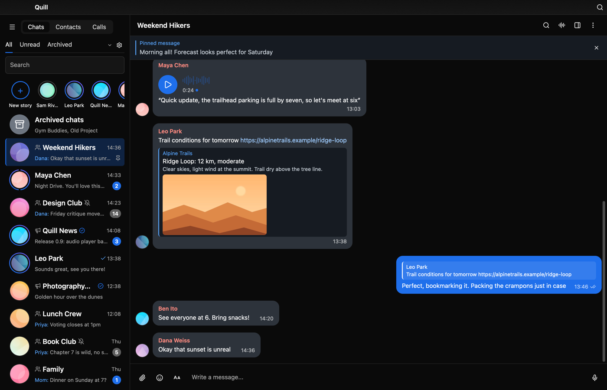
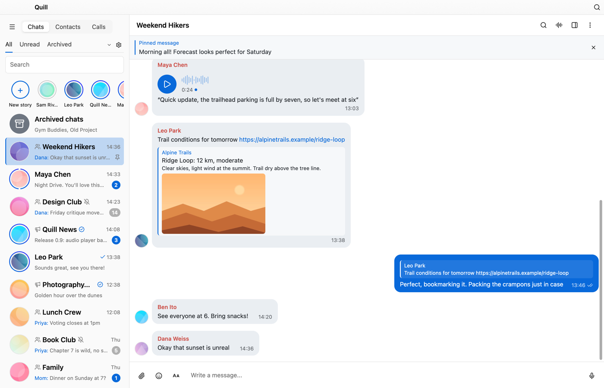
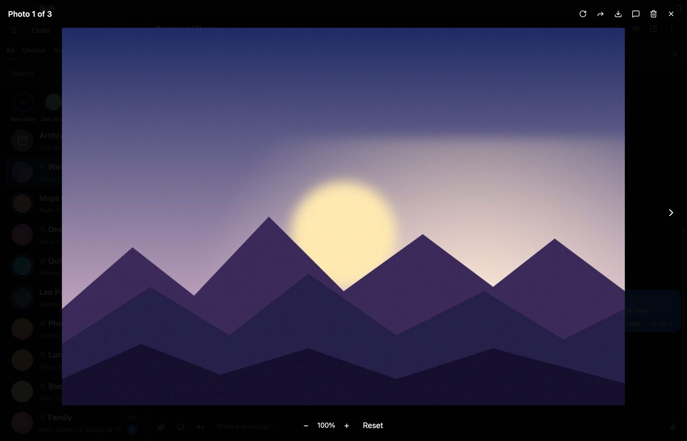
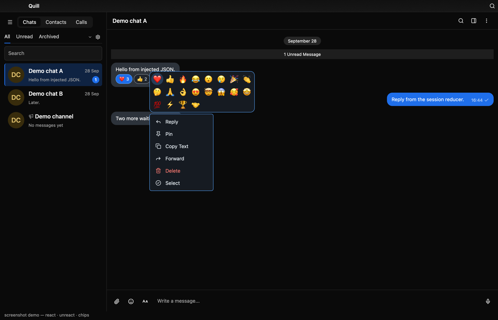
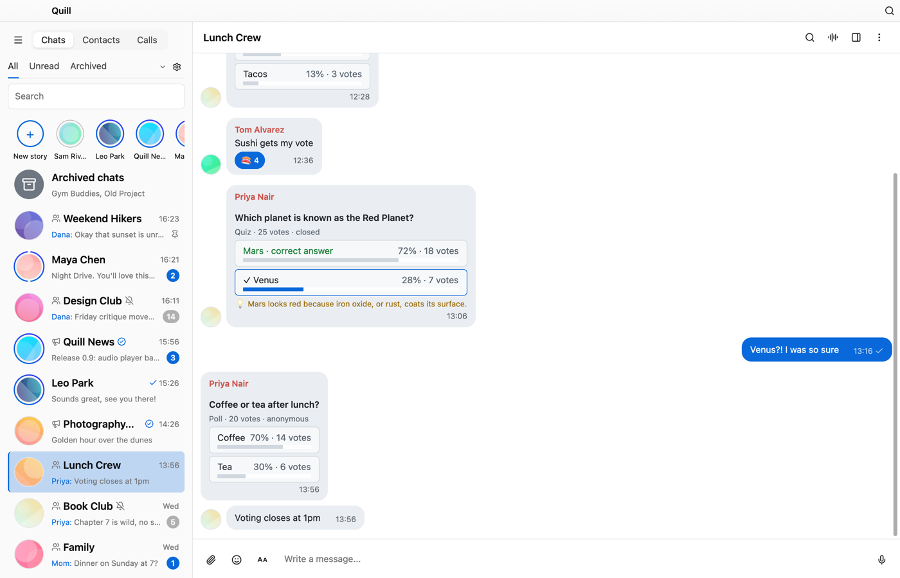
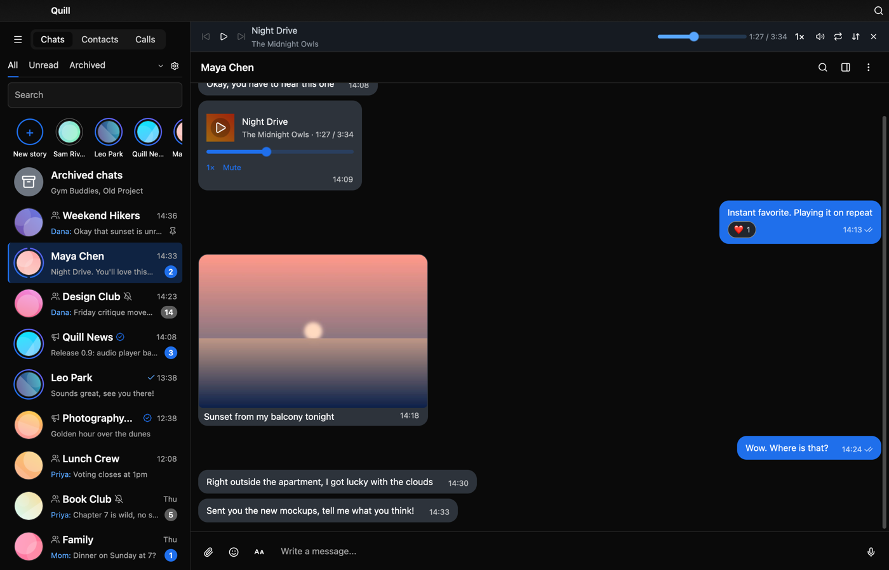
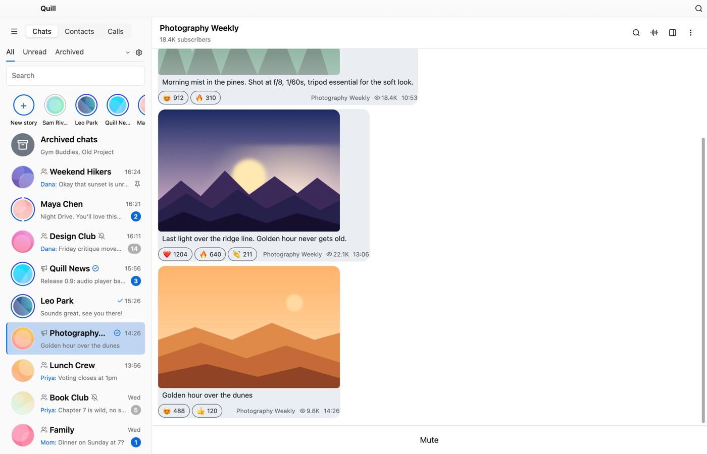
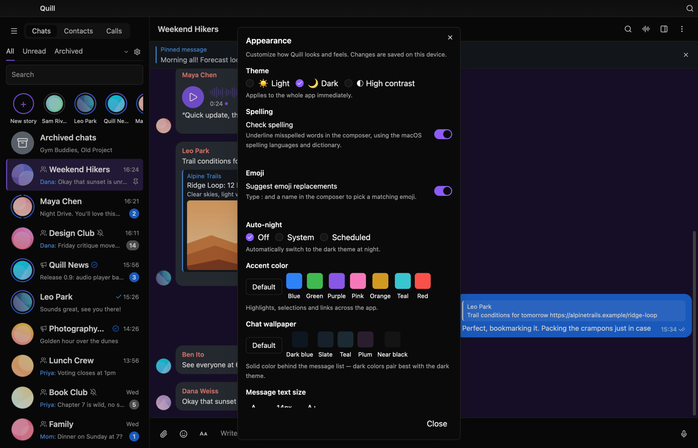
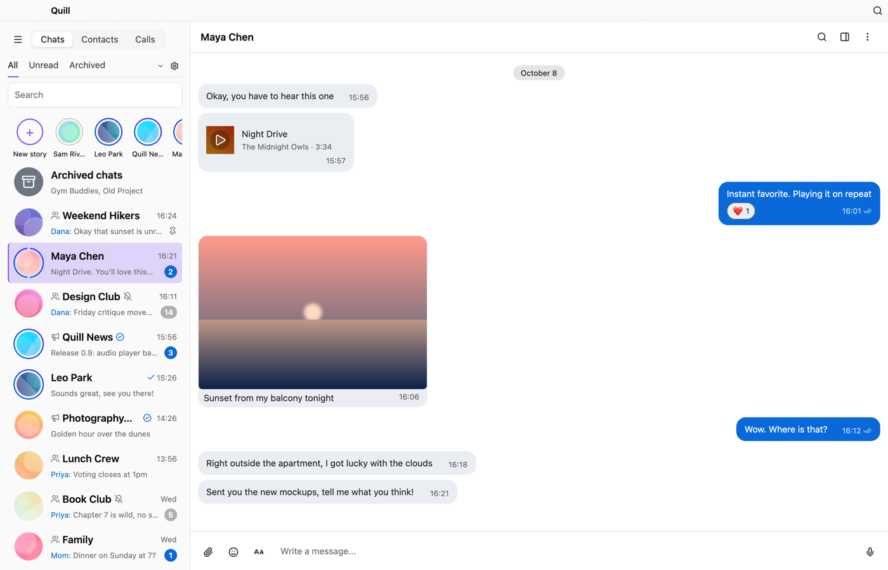

# Quill

[](https://github.com/shinycake/quill/actions/workflows/ci.yml)


Quill is an independent, unofficial Telegram desktop client written in Rust. It uses Telegram's official [TDLib](https://core.telegram.org/tdlib) library for everything that talks to Telegram, and draws its interface with [GPUI](https://www.gpui.rs).

> [!WARNING]
> Quill is not affiliated with, endorsed by, or sponsored by Telegram (Telegram FZ-LLC or Telegram Messenger Inc.). "Telegram" is a trademark of its owner, and Quill uses the name only to say which service it works with.
>
> Quill is early, experimental software. Use it at your own risk. It comes with no warranty, as the [MIT license](LICENSE) states, and the maintainers are not responsible for lost data, account restrictions or bans, missed messages, or any other damage. Keep an official Telegram app installed and back up anything you can't afford to lose.

Quill is under active development. The [progress dashboard](https://shinycake.github.io/quill-dashboard) shows where it stands.

## Screenshots

<table>
  <tr>
    <td><br/><sub>Group chat · dark</sub></td>
    <td><br/><sub>Group chat · light</sub></td>
    <td><br/><sub>Media viewer</sub></td>
  </tr>
  <tr>
    <td><br/><sub>Reactions &amp; message menu</sub></td>
    <td><br/><sub>Polls &amp; quizzes</sub></td>
    <td><br/><sub>Audio player bar</sub></td>
  </tr>
  <tr>
    <td><br/><sub>Channels</sub></td>
    <td><br/><sub>Appearance settings</sub></td>
    <td><br/><sub>Accent colors</sub></td>
  </tr>
</table>

Captured from a real GPUI window using demo fixtures (no live Telegram). The [full gallery](docs/screenshots/README.md) has 130+ captures covering auth, chats, media, calls, bots, settings, and more.

## What is Quill?

Quill is a Telegram client for macOS, Windows and Linux, written from scratch. It does not implement the Telegram protocol itself. TDLib handles the connection, so you sign in to your real account and see your real chats and contacts. The interface is a native Rust app built on GPUI.

It is not a clone of Telegram Desktop. The aim is an app that feels fast, behaves reliably and can be driven from the keyboard. Nobody has measured its speed against the official apps yet.

## Highlights

- Sign in with a phone code, a QR code or a two-step verification password, with password recovery by email. Switch between several accounts and manage your active sessions.
- Write messages with bold, italic, code, spoilers, quotes and links. Reply or quote-reply, forward, schedule or send silently, keep drafts in the cloud, search inside a chat, react, and vote in polls.
- Photos, videos, albums, GIFs and stickers. Voice and video messages are recorded inside the app and can be transcribed. There is an audio player bar, a fullscreen media viewer, link previews and a downloads list.
- One-to-one audio and video calls with screen sharing, and group voice chats. Live video and screen sharing inside group calls are not verified yet (see the Calls checklist below).
- Group and channel admin tools: invite links, join requests, and statistics with growth charts. Bots with keyboards and games.
- Light and dark themes, automatic night mode, accent colors, chat wallpapers, adjustable text size, and bubble or plain message layout.
- Secret chats, per-session switches for accepting secret chats and calls, and detailed notification and archive settings.
- `tg://` and `t.me` deep links, a tray menu with switches for notifications, unread badges, and packages for macOS, Windows and Linux.

## Download

Release packages are published on the [GitHub Releases page](https://github.com/shinycake/quill/releases). No release has been published yet, so for now you need to build from source.

The packages target:

- macOS 14 or later on Apple Silicon
- Linux on x86_64 (glibc), as a relocatable tarball with an `install.sh`
- Windows 10 or later on x86_64, as a zip you unpack and run

The packages do not include a Telegram API ID. To sign in you need your own, as described in the next section.

## Build from source

[docs/build.md](docs/build.md) covers each platform and the packaging scripts. The short version:

```bash
cargo test --no-default-features
cargo run --features ui          # live connect with your Telegram credentials + tdjson
cargo run --no-default-features -- --connect-smoke   # headless WaitPhoneNumber gate
```

Without credentials, `cargo run --features ui` opens a synthetic demo chat. To sign in to a real account, get your own API ID and hash from [my.telegram.org](https://my.telegram.org) and build TDLib with `scripts/build-tdlib.sh`. Then set `TELEGRAM_API_ID` and `TELEGRAM_API_HASH` in the environment or in a gitignored `quill.local.env` file, and point `QUILL_TDJSON_PATH` at the library. [docs/credentials.md](docs/credentials.md) has the details. Don't reuse another app's API ID: Telegram's [API terms](https://core.telegram.org/api/terms) require every app to have its own.

On Linux, building the UI also needs the GTK 3 and ALSA development packages (`libgtk-3-dev` and `libasound2-dev` on Debian and Ubuntu).

Toolchain: Rust 1.98.1, pinned in `rust-toolchain.toml` (the minimum supported version is 1.92). UI: gpui-kit 0.7.1. TDLib: 1.8.68.

## Status

This is the comprehensive Telegram-parity checklist: one checkbox per user-visible feature/behavior, grouped by area, each with a stable `parity:<area>-<slug>` anchor. `[x]` means the feature genuinely works in Quill today; partial implementations stay unchecked with a note. The parity percentage is computed from this section by `scripts/parity_pct.sh` — never estimated. Newly discovered gaps are added here, so the percentage may drop when audits find new gaps. Feature PRs declare completed items in parity-fragments/<slice-id>.txt; the merge pipeline checks the boxes here after each merge (parity may lag a merge by a few minutes).

A weekly `telegram-update-watch` scheduled job keeps this checklist current with official Telegram releases: new release features are verified against the pinned TDLib schema and added here as unchecked items with `parity:` anchors. Items blocked on missing TDLib APIs are marked `(blocked:)` with the reason.

### Auth & accounts

- [x] Phone-number login: country code, invalid/banned-number errors, SMS hint <!-- parity:auth-phone-login --> (README:24; telegram/requests.rs:51)
- [x] Verification-code entry: expected digit count, invalid-code handling <!-- parity:auth-code-entry --> (auth.rs:44; telegram/requests.rs:71)
- [x] Resend the login code: "Resend code" on the code screen sends resendAuthenticationCode (reason resendCodeReasonUserRequest); no invented local cooldown — a too-early resend fails server-side (429) and surfaces via the auth-error line <!-- parity:auth-code-resend -->
- [x] Two-step password entry on login <!-- parity:auth-2fa-password --> (auth.rs:52; telegram/requests.rs:81)
- [x] Log in via QR code: "Sign in with QR code" on the phone screen sends requestQrCodeAuthentication; the link from authorizationStateWaitOtherDeviceConfirmation renders as a real QR bitmap (never logged) <!-- parity:auth-qr-login -->
- [ ] "Link desktop device": show QR so another device can log in as this account <!-- parity:auth-qr-authorize-other -->
- [x] New-user registration: first/last name + terms <!-- parity:auth-registration -->
- [x] Email-based login flow <!-- parity:auth-email-login -->
- [ ] Premium-purchase-gated login state (partial: explicit UnsupportedHalt, auth.rs:66) <!-- parity:auth-premium-login -->
- [x] Enable / change / disable the two-step password: "Two-Step Verification" overlay (TGX wording) shows the authoritative getPasswordState; setPassword enable (empty old, optional recovery email in the same call), change, and disable (empty new); no optimistic mutations, one op in flight, passwords zeroized and never logged <!-- parity:auth-2fa-manage -->
- [x] Set / change recovery email, pending-confirmation state, abort setup: setRecoveryEmailAddress (current password required), pending pattern card (TGX PendingEmailText), resend (resendRecoveryEmailAddressCode, no invented cooldown) and "Abort recovery email setup" (TGX AbortRecoveryEmail verbatim) <!-- parity:auth-recovery-email -->
- [x] Password recovery via emailed code: "Forgot password?" on the 2FA screen sends requestAuthenticationPasswordRecovery (resend re-issues it — no invented cooldown, 429 surfaces), recovery-code entry sends recoverAuthenticationPassword (code zeroized, never stored — the A2 rule; new password empty, re-enable 2FA in Settings); recovery removes 2FA and TDLib continues auth <!-- parity:auth-password-recovery --> (A10: requests.rs; state.rs:RequestPurpose; connect.rs:request_password_recovery/submit_recovery_code; ui/mod.rs)
- [x] Active Sessions list: device/app/IP/location with current-device marker (schema: getActiveSessions) <!-- parity:auth-sessions-list --> (telegram/requests.rs:57; telegram/envelope.rs:8110; ui/mod.rs:24263)
- [x] Incomplete login attempts list with per-attempt terminate (TGX SessionsIncompleteTitle/Info) <!-- parity:auth-sessions-incomplete --> (ui/mod.rs:24263 — is_password_pending section)
- [x] Terminate one session, with confirmation (schema: terminateSession; TGX TerminateSessionQuestion) <!-- parity:auth-session-terminate-one --> (telegram/requests.rs:67; connect.rs: terminate_session; ui/mod.rs: confirm banner)
- [x] Terminate all other sessions, with confirmation (schema: terminateAllOtherSessions; TGX AreYouSureSessions) <!-- parity:auth-sessions-terminate-all --> (telegram/requests.rs:79; connect.rs: terminate_all_other_sessions; ui/mod.rs: confirm banner)
- [x] Per-session toggles: accept secret chats / accept calls (schema: toggleSessionCanAcceptSecretChats, toggleSessionCanAcceptCalls; TGX SessionAccepts) <!-- parity:auth-session-toggles -->
- [x] "Logged in with Telegram" websites list + disconnect all (TGX WebSessionsTitle, TerminateAllWebSessions) <!-- parity:auth-web-sessions -->
- [x] Log out (telegram/requests.rs:98; state.rs:6502 invalidates account) <!-- parity:auth-logout -->
- [x] Logout warning text: secret chats die, downloaded media erased (TGX SignOutHint2) (Account dialog → Log out → confirm banner with the warning → logOut → `authorizationStateLoggingOut → Closed` → connection restarts to the login screen) <!-- parity:auth-logout-warning -->
- [x] Add another account / switch between accounts: account registry + active account + add/remove backend (src/settings.rs; PR #214), Accounts dialog UI (list with active badge, switch via shutdown/set_active/start_live_connect_for_account, add with display-name input, remove non-active with inline confirm) (src/ui/accounts.rs) <!-- parity:auth-multi-account -->
- [ ] Change phone number: move contacts/groups/messages/media to a new number (partial: A8 backend shipped — sendPhoneNumberCode/checkPhoneNumberCode/resendPhoneNumberCode with phoneNumberCodeTypeChange while authorized (NOT re-auth), + connect + reducer; UI blocked on server-acceptance verification: schema marks phoneNumberCodeTypeChange "for official Android and iOS applications only") <!-- parity:auth-change-number -->
- [x] Delete account with "Deleted Account" explainer: "🗑️ Account" sidebar entry → kit Dialog with the TGX-verbatim explainer (chats see you as Deleted Account), optional reason field, 2FA password field only when `passwordState.has_password`, inline "Alright, delete account." final confirm; password zeroized and never logged (A7: deleteAccount builder + connect + reducer; A9: UI) <!-- parity:auth-delete-account -->
- [x] Self-destruct-if-away timer: kit RadioGroup picker with the TGX-verified options (1/3/6/12/18/24 months → 31/91/181/366/546/730 days); current value rendered with TGX's display rule; confirmed days land from the authoritative `ok`, never optimistic (A7: getAccountTtl/setAccountTtl builders + connect + cached days; A9: UI) <!-- parity:auth-account-ttl -->
- [x] Contacts list with empty state (ui/mod.rs:7729 contacts_list; telegram/requests.rs:364 getContacts) <!-- parity:auth-contacts-list -->
- [x] Add contact via dialog: phone (required), first/last name -> addContact (ui/mod.rs:9469; telegram/requests.rs:379) <!-- parity:auth-contact-add -->
- [x] Delete contact (schema: removeContacts; TGX DeleteContactConfirm) <!-- parity:auth-contact-delete -->
- [x] Import contacts from a file/vCard (schema: importContacts) <!-- parity:auth-contact-import -->
- [x] Sync contacts toggle + delete synced contacts from servers (TGX SyncContacts*, SyncContactsDeleteInfo) <!-- parity:auth-contact-sync -->
- [x] Block user with confirmation (TGX QBlockUser/BlockUserConfirm; no block request builders in Quill) <!-- parity:auth-block-user -->
- [x] Edit name: "Edit profile" dialog on the own info panel sends setName (telegram/requests.rs:4213; connect.rs:8910; ui/mod.rs:18963) <!-- parity:auth-edit-name -->
- [x] Edit bio: "Edit profile" dialog sends setBio; the info panel now also renders the bio from getUserFullInfo (telegram/requests.rs:4224; connect.rs:8924; ui/mod.rs:18963) <!-- parity:auth-edit-bio -->
- [x] Username management: Check availability via checkChatUsername (private chat with self; all six checkChatUsernameResult verdicts parsed, envelope.rs:2386), set/clear editable username (empty clears per schema :14830), up/down reorder of active usernames, activate/deactivate (editable username can't be deactivated per schema :14835); schema: setUsername, reorderActiveUsernames, toggleUsernameIsActive (telegram/requests.rs:4235; connect.rs:8935; ui/mod.rs:18963) <!-- parity:auth-username -->
- [x] Set / remove profile photo: setProfilePhoto via inputChatPhotoStatic + inputFileLocal with is_public hard-coded false for the main (non-public) photo (schema :14803; TGX AvatarPickerManager), remove via deleteProfilePhoto with the retained chatPhoto.id (state.rs:3771) (telegram/requests.rs:4283; connect.rs:9006; ui/mod.rs:18963) <!-- parity:auth-profile-photo -->
- [x] Profile accent color (schema: setProfileAccentColor) <!-- parity:auth-profile-accent -->
- [x] Country picker with search and national phone number formatting <!-- parity:auth-country-picker -->
- [x] "Code didn't arrive" and reset login email <!-- parity:auth-code-missing -->
- [x] Dedicated box for banned phone numbers <!-- parity:auth-phone-banned-box -->
- [x] Note about the maximum number of accounts <!-- parity:auth-max-accounts-note -->
- [ ] Hidden test-server and debug log toggles (deferred: low impact) <!-- parity:auth-debug-toggles -->

### Messaging core

- [x] Send plain text message (`sendMessage`, Enter to send) <!-- parity:msg-send-text --> (telegram/requests.rs:1574; send-on-Enter gate composer.rs:20)
- [x] Bold formatting authoring (entities apply to message text and captions) <!-- parity:msg-bold --> (M1: toolbar B / Ctrl-B inserts **bold**; send converts to textEntityTypeBold requests.rs)
- [x] Italic formatting authoring (entities apply to message text and captions) <!-- parity:msg-italic --> (M1: toolbar I / Ctrl-I inserts *italic*; send converts to textEntityTypeItalic)
- [x] Underline formatting authoring (entities apply to message text and captions) <!-- parity:msg-underline --> (M1: toolbar U / Ctrl-U inserts __underline__; send converts to textEntityTypeUnderline)
- [x] Strikethrough formatting authoring (entities apply to message text and captions) <!-- parity:msg-strikethrough --> (M1: toolbar S inserts ~~strike~~; send converts to textEntityTypeStrikethrough)
- [x] Inline code / monospace authoring (entities apply to message text and captions) <!-- parity:msg-inline-code --> (M1: toolbar </> inserts `code`; send converts to textEntityTypeCode)
- [x] Code block / pre (with language) authoring (entities apply to message text and captions) <!-- parity:msg-code-block --> (M1: toolbar pre inserts fenced block, optional language; send converts to textEntityTypePre/PreCode)
- [x] Spoiler authoring (entities apply to message text and captions) <!-- parity:msg-spoiler --> (M1: toolbar spoiler inserts ||spoiler||; send converts to textEntityTypeSpoiler)
- [x] Quote/blockquote formatting authoring (entities apply to message text and captions) <!-- parity:msg-quote-block --> (M1: toolbar quote prefixes > lines; send converts to textEntityTypeBlockQuote)
- [x] Create text link (textUrl) authoring (entities apply to message text and captions) <!-- parity:msg-text-link --> (M1: toolbar link inserts [label](url); send converts to textEntityTypeTextUrl)
- [x] Clear formatting on selection (applies to message text and captions) <!-- parity:msg-clear-formatting --> (M1: toolbar clear strips markup on selection or whole text, composer.rs)
- [x] Reply to a message <!-- parity:msg-reply --> (begin_reply_to ui/mod.rs:4269)
- [x] Quote selected text in a reply — "Quote reply" menu item → quote picker → validated UTF-16 offset → `inputTextQuote` on every send path (text, media, albums, voice notes, GIFs/stickers, polls); ❝quote❞ shown in the reply banner (src/composer.rs, src/telegram/requests.rs, src/ui/mod.rs) <!-- parity:msg-reply-quote -->
- [x] Reply bar in composer with cancel <!-- parity:msg-reply-bar-cancel --> (cancel_reply_draft composer.rs:131)
- [x] Swipe-to-reply gesture <!-- parity:msg-swipe-reply --> (M1: leftward drag >24px on a message starts a reply, ui/mod.rs)
- [x] Forward with "Forwarded from" attribution <!-- parity:msg-forward-attribution --> (forward_messages, send_copy:false requests.rs:2172)
- [x] Forward as copy / hide sender (send_copy hardcoded false, requests.rs:2184) <!-- parity:msg-forward-hide-sender --> (M1: forward picker "Hide sender name" -> forwardMessages send_copy:true, requests.rs)
- [x] Remove caption on forward copy (remove_caption hardcoded false) <!-- parity:msg-forward-remove-caption --> (M1: forward picker "Remove caption" (with send-copy) -> remove_caption:true)
- [x] Multi-select forward (per-message Select) <!-- parity:msg-forward-multiselect --> (toggle_forward_select ui/mod.rs:4682; 100-msg cap connect.rs)
- [x] Forward destination picker <!-- parity:msg-forward-picker --> (forward_destinations state.rs:6585; begin_forward_one ui/mod.rs:4654)
- [x] Edit own message text <!-- parity:msg-edit-text --> (edit_message_text requests.rs:2097; begin_edit ui/mod.rs:21954)
- [x] Edit media caption <!-- parity:msg-edit-caption --> (edit_message_caption requests.rs:2125; wired connect.rs:4989)
- [x] Cancel edit restores prior draft <!-- parity:msg-edit-cancel-restores --> (cancel_edit_draft composer.rs:213)
- [x] Delete own message for everyone (confirm dialog) <!-- parity:msg-delete-everyone --> (delete_confirmed, revoke:true connect.rs:5043; confirm_delete ui/mod.rs:4371)
- [x] Delete for me / delete incoming messages (DeleteConfirm::own requires own-outgoing composer.rs:243; revoke always true) <!-- parity:msg-delete-for-me --> (M1: incoming messages deletable with revoke:false; banner toggles for-me/everyone, gated on can_revoke)
- [x] Pin message <!-- parity:msg-pin --> (toggle_pin_message ui/mod.rs:11464)
- [x] Unpin message (same toggle, Pin/Unpin row button ui/mod.rs:21992) <!-- parity:msg-unpin -->
- [x] Silent pin toggle (partial: pin_chat_message takes disable_notification requests.rs:2274; UI toggles without the option) <!-- parity:msg-pin-silent --> (M1: composer silent toggle feeds disable_notification to pinChatMessage)
- [x] Unpin all messages (unpinAllChatMessages unwired in UI) <!-- parity:msg-unpin-all --> (M1: "Unpin all" button in pinned banner when >1 *loaded* row is pinned; the count reflects loaded history rows, while unpinAllChatMessages acts server-side on all pins)
- [x] Copy message text (only inline-button CopyText ui/mod.rs:3932 and invite-link copy exist) <!-- parity:msg-copy-text --> (M1: right-click context menu Copy on text/caption messages)
- [x] Share message / copy t.me link (getMessageLink unused) <!-- parity:msg-share-link --> (M1: right-click Share link -> getMessageLink -> clipboard)
- [x] Scheduled send (send at date; options:null, schema messageSchedulingStateSendAtDate td_api.tl:5902) <!-- parity:msg-scheduled-send --> (M1: schedule popup +1h/+8h/+24h via messageSchedulingStateSendAtDate)
- [x] Scheduled messages list / edit / delete <!-- parity:msg-scheduled-list --> (M1: getChatScheduledMessages dialog with list, edit (editMessageText), delete)
- [x] Send when online (schema messageSchedulingStateSendWhenOnline td_api.tl:5905; private chats only) <!-- parity:msg-send-when-online --> (M1: schedule popup "when online" via messageSchedulingStateSendWhenOnline, offered only in private chats)
- [x] Silent send / disable notification (send options always null) <!-- parity:msg-silent-send --> (M1: silent toggle -> messageSendOptions.disable_notification; non-null options on every sendMessage)
- [x] Cloud drafts synced via setChatDraftMessage (debounced save) <!-- parity:msg-cloud-drafts --> (requests.rs:1537; DraftSaveClock composer.rs:333; ui/mod.rs:12226)
- [x] Draft preserves reply context <!-- parity:msg-draft-reply-context --> (begin_edit_draft composer.rs:221; updateChatDraftMessage handled)
- [x] Delivery status on outgoing (sending / sent / read) <!-- parity:msg-delivery-status --> (outgoing_status_label state.rs:893; outbox_receipt state.rs:1177)
- [x] Mark history read (viewMessages after openChat) <!-- parity:msg-mark-read --> (requests.rs:1470, 306)
- [x] Typing indicator from peer <!-- parity:msg-typing-receive --> (updateChatAction → typing_senders state.rs:930)
- [x] Send typing indicator <!-- parity:msg-typing-send --> (sendChatAction requests.rs:2392)
- [x] Retry/resend failed message (resendMessages unwired) <!-- parity:msg-retry-failed --> (M1: failed sends marked red with retry hint; right-click Retry -> resendMessages)
- [x] In-chat message search <!-- parity:msg-in-chat-search --> (search_chat_messages requests.rs:213; chat_search_input ui/mod.rs:575)
- [x] Per-message hover actions (Reply/Forward/Select/Edit/Delete/React/Pin) <!-- parity:msg-row-actions --> (ui/mod.rs:21917+)
- [x] Right-click context menu (no right-click handlers; hover buttons only) <!-- parity:msg-context-menu --> (M1: right-click menu Reply/Copy/Forward/Pin/Unpin/Share link/Retry/Delete)
- [x] Link preview options on send (partial: received previews render card ui/mod.rs:22404; send has link_preview_options:null, no toggle) <!-- parity:msg-link-preview-toggle --> (M1: previews toggle -> linkPreviewOptions.is_disabled; secret chats force off)
- [x] Rich text editor: expand icon after 3+ lines, produces inputRichMessage <!-- parity:msg-richtext-editor -->
- [x] Inline documents/files/music inside text blocks (pageBlockDocument / inputPageBlockDocument) <!-- parity:msg-richtext-inline-doc -->
- [x] Send rich messages (inputMessageRichMessage) <!-- parity:msg-richmessage-send -->
- [x] Render richMessage PageBlocks in message bubbles (messageRichMessage, getFullRichMessage) <!-- parity:msg-richmessage-render -->
- [x] In-message buttons: render pageBlockButtonRow + richTextButton, taps fire bot callbacks <!-- parity:msg-richmessage-buttons -->
- [x] Ephemeral messages: render message.ephemeral_content instead of regular content <!-- parity:msg-ephemeral-render -->
- [x] Apply updateMessageEphemeralContent (ephemeral content refreshes over time; initial render covered by parity:msg-ephemeral-render) <!-- parity:msg-ephemeral-updates -->
- [x] Compact tables in rich messages <!-- parity:msg-richtext-tables -->
- [x] Expandable block quotes (long block quotes collapse with an expand affordance; authoring covered by parity:msg-quote-block) <!-- parity:msg-blockquote-expandable -->
- [x] Inline photos/videos in the rich-text composer (pageBlockPhoto/pageBlockVideo ↔ inputPageBlockPhoto/inputPageBlockVideo; emoji+caption tile render) <!-- parity:msg-richtext-inline-media -->
- [x] AI tools in the rich-text composer (composeTextWithAi, composeRichMessageWithAi, createRichMessageWithAi, fixTextWithAi, fixRichMessageWithAi) <!-- parity:msg-richtext-ai-tools -->
- [x] Rich-text composer max length (32,768 chars) <!-- parity:msg-richtext-max-length -->
- [x] Premium gating of the rich-text editor <!-- parity:msg-richtext-premium-gate -->

### Message rendering

- [x] Clickable @mentions, #hashtags, $cashtags, /commands, emails, phone numbers, bank cards, media timestamps and dates in message text <!-- parity:render-entity-links -->
- [x] Tapping a /command in a group chat sends it addressed to that bot <!-- parity:render-bot-command-click -->
- [ ] Tapping a timestamp link seeks the video or voice message to that moment <!-- parity:render-media-timestamp-seek -->
- [x] "Open this link?" confirmation when a link's label differs from its real address <!-- parity:render-hidden-link-confirm -->
- [ ] Hovering a text link shows its full address in a tooltip <!-- parity:render-link-hover-tooltip -->
- [x] Reply header shows the replied sender's name in their color <!-- parity:render-reply-header-sender -->
- [ ] Reply header shows a media thumbnail, quote mark, other-chat name, and story replies <!-- parity:render-reply-header-media -->
- [x] Replied-to messages outside the loaded history are fetched and previewed <!-- parity:render-reply-outside-window -->
- [ ] Reply header custom-emoji pattern and accent background <!-- parity:render-reply-header-emoji-pattern -->
- [x] "edited" marker in the message footer <!-- parity:render-edited-marker -->
- [x] Hovering the message time shows full sent, edited and original-forward dates <!-- parity:render-time-tooltip -->
- [x] Forward header opens the original chat or post; hidden senders get a tooltip <!-- parity:render-forward-header-click -->
- [x] "via @bot" attribution on messages sent through an inline bot <!-- parity:render-via-bot -->
- [x] "N comments" bar with commenter avatars under channel posts and reply counters in groups <!-- parity:render-comments-bar -->
- [x] Service messages name the people involved and their names are clickable <!-- parity:render-service-actors -->
- [x] Pinned-message service row shows an excerpt and jumps to the message <!-- parity:render-service-pinned-excerpt -->
- [ ] Group photo change service row shows the new photo and opens it <!-- parity:render-service-photo-thumb -->
- [x] Video chat service rows: ended with duration, scheduled, and invited members <!-- parity:render-service-video-chat -->
- [x] Forum topic created, edited, closed and hidden service rows <!-- parity:render-service-topics -->
- [x] Chat theme and wallpaper change service rows <!-- parity:render-service-theme-wallpaper -->
- [x] Owner change, boost, game score and proximity alert service rows <!-- parity:render-service-owner-boost-game -->
- [ ] Suggested profile photo and birthday rows with an Accept action <!-- parity:render-service-suggestions -->
- [x] Service rows for users or chats shared with a bot, web-app data sent and bot write access allowed <!-- parity:render-service-bot-shared -->
- [x] Protected-content toggled and disable-requested service rows <!-- parity:render-service-protected-content -->
- [x] Payment refunded, paid-message refunded and price-changed service rows <!-- parity:render-service-payment-refund -->
- [ ] Forwarded story messages and story mentions <!-- parity:render-story-message -->
- [ ] Paid media shows a blurred locked preview with an unlock button <!-- parity:render-paid-media -->
- [x] Checklist messages render with tasks and done marks <!-- parity:render-checklist -->
- [x] Gift and giveaway messages render as cards (regular, unique, refunded, prize, winners, gift code) <!-- parity:render-gift-cards -->
- [x] Contact cards show an avatar with Message, Add contact and View buttons <!-- parity:render-contact-card-actions -->
- [x] Location and venue messages show a map thumbnail <!-- parity:render-map-thumbnail -->
- [ ] Live location shows remaining time, live updates and a stop-sharing action <!-- parity:render-live-location -->
- [ ] Dice, dart and slot machine messages play their animation and result <!-- parity:render-dice-playback -->
- [ ] Tapping an animated emoji plays a fullscreen effect <!-- parity:render-emoji-interaction -->
- [ ] Premium sticker fullscreen effect <!-- parity:render-premium-sticker-effect -->
- [ ] Message effects playback (deferred: low impact) <!-- parity:render-message-effects -->
- [ ] Theme and wallpaper link previews with a preview card (deferred: low impact) <!-- parity:render-theme-wallpaper-docs -->
- [ ] Similar channels carousel after joining a channel <!-- parity:render-similar-channels -->
- [ ] Link-preview "View channel / bot / message" buttons <!-- parity:render-preview-view-button -->
- [x] Bubble tails and grouped-message corner radii <!-- parity:render-bubble-tails -->
- [x] Sender avatar sticks to the bottom of a group of messages while scrolling <!-- parity:render-sticky-avatar -->
- [x] Code blocks show a language header with a Copy button <!-- parity:render-code-block-header -->
- [ ] "Photo has expired" style placeholders for expired media (partial: generic unsupported card for some) <!-- parity:render-expired-media -->
- [ ] Fact-check block under messages <!-- parity:render-fact-check -->
- [ ] "About sponsored messages" info box from the Ad menu <!-- parity:render-sponsored-info -->

### Message menu & selection

- [x] Copy Image from the message menu <!-- parity:menu-copy-image -->
- [x] Save As for photos, videos, audio, files and GIFs from the message menu <!-- parity:menu-save-as -->
- [x] Show in Folder / Finder from the message menu <!-- parity:menu-show-in-folder -->
- [x] Copy Filename for documents <!-- parity:menu-copy-filename -->
- [x] Cancel Download / Cancel Upload from the message menu <!-- parity:menu-cancel-transfer -->
- [x] Add to GIFs and Open GIF from the message menu <!-- parity:menu-gif-actions -->
- [x] Add or remove favorite sticker, View Sticker Set and Add Stickers from the message menu <!-- parity:menu-sticker-actions -->
- [x] Attached Stickers for photos that contain stickers <!-- parity:menu-attached-stickers -->
- [ ] "This message contains emoji from X pack" footer <!-- parity:menu-emoji-pack-footer -->
- [x] Report a message with a reason flow, also from the selection bar <!-- parity:menu-report-message -->
- [x] "N Seen / N Reacted" row with reader and reactor lists and read date <!-- parity:menu-seen-by -->
- [x] "Sent today at 12:34" row in the message menu <!-- parity:menu-sent-time-row -->
- [x] Translate message and Translate selected text <!-- parity:menu-translate -->
- [ ] Reply in Another Chat <!-- parity:menu-reply-another-chat -->
- [ ] Reply options popover: Update Quote, Do Not Reply, Show in Chat <!-- parity:menu-reply-options -->
- [ ] Reply with a timecode on videos and voice messages <!-- parity:menu-reply-timecode -->
- [ ] Edit Image, Edit Video and Edit Cover on your own media <!-- parity:menu-edit-media-items -->
- [x] Replace or add media when editing a message <!-- parity:menu-edit-message-media -->
- [ ] Go To Message from search, pinned and saved lists <!-- parity:menu-go-to-message -->
- [ ] Add or edit a fact check as a channel admin <!-- parity:menu-fact-check-edit -->
- [ ] Save an audio message as a notification tone <!-- parity:menu-save-notification-tone -->
- [ ] Copy Post Link versus Copy Message Link wording and "members only" hint <!-- parity:menu-copy-post-link-wording -->
- [ ] Copy Card Number for bank-card entities <!-- parity:menu-copy-card-number -->
- [ ] Poll menu: Retract vote, View results and ends-in note <!-- parity:menu-poll-actions -->
- [ ] Saved Messages tag menu: Filter by Tag, Add or Edit Name, Remove Tag <!-- parity:menu-saved-tag-menu -->
- [ ] Info line explaining why Forward and Copy are missing in protected chats <!-- parity:menu-noforwards-note -->
- [x] Admin delete box: delete all from user, ban and report spam in one step <!-- parity:menu-moderate-delete -->
- [x] Delete a member's reaction as an admin <!-- parity:menu-delete-reaction -->
- [x] Selection bar: Copy Selected as Text <!-- parity:selection-copy-text -->
- [ ] Selection bar: Download, Save, Unpin, Report, Send Now and Reschedule selected messages <!-- parity:selection-bulk-actions -->
- [ ] Drag-select across messages and Shift-click range selection <!-- parity:selection-drag-range -->
- [x] Delete key removes the selected messages and Esc clears the selection <!-- parity:selection-delete-key -->
- [ ] Keyboard selection with Ctrl+Space and per-message focus <!-- parity:selection-keyboard -->
- [x] Pin confirmation with "Notify all members" and "Also pin for {user}" <!-- parity:pin-confirm-options -->
- [x] Unpin-all and hide-pinned confirmations with message counts (partial: basic confirm exists) <!-- parity:pin-unpin-all-confirm -->

### Composer & sending

- [ ] Formatting shows live in the input (bold appears bold, mentions as tags, custom emoji inline) <!-- parity:composer-wysiwyg -->
- [ ] Mention without a username inserts a styled tag instead of raw markup <!-- parity:composer-mention-tags -->
- [x] Send as another identity (channel or anonymous) picker <!-- parity:composer-send-as -->
- [x] Forward bar in the composer: change recipient, hide sender or captions, add a comment <!-- parity:composer-forward-bar -->
- [x] Share box: several destinations, comment, silent or scheduled, server search, copy link <!-- parity:composer-share-box -->
- [ ] Repeating scheduled messages (Premium) <!-- parity:composer-repeat-schedule -->
- [x] Send a dice, dart, basketball, football, bowling or slot machine by sending its emoji alone <!-- parity:composer-send-dice -->
- [x] Share a contact card from a profile <!-- parity:composer-share-contact -->
- [x] Create checklists <!-- parity:composer-checklist -->
- [ ] Attachment-menu bots in the attach menu <!-- parity:composer-attach-bots -->
- [ ] Drop zones: send quickly versus as documents; dropped folder becomes an archive <!-- parity:composer-drop-modes -->
- [ ] Send box options: HD photo toggle, GIF with caption, paid media price, video cover <!-- parity:composer-send-options -->
- [x] Link preview options popover: choose link, move up or down, shrink or enlarge <!-- parity:composer-link-options -->
- [x] Move caption above or below media from the send box <!-- parity:composer-caption-move -->
- [ ] Clear placeholders when text or a media type is not allowed <!-- parity:composer-restricted-placeholder -->
- [ ] Premium-only and paid-message gates ("charges N per message", "only accepts messages from contacts") <!-- parity:composer-paid-gates -->
- [x] Show and hide button for bot reply keyboards <!-- parity:composer-bot-keyboard-toggle -->
- [x] Reply keyboards update from the server outside the loaded history <!-- parity:composer-reply-markup-update -->
- [x] Keyboard buttons that request users, a chat or a phone number <!-- parity:composer-keyboard-request-buttons -->
- [ ] Inline bot results in a grid and the "switch to PM" button <!-- parity:composer-inline-grid -->
- [x] Recent inline bots suggested when typing @ <!-- parity:composer-recent-inline-bots -->
- [x] Greeting sticker in an empty private chat <!-- parity:composer-greeting-sticker -->
- [ ] Up arrow on a pending media message opens its caption for editing <!-- parity:composer-up-edit-media -->
- [ ] Insert Unicode, subscript, superscript, date formatting and formula menu (deferred: low impact) <!-- parity:composer-unicode-menu -->
- [ ] Code-block language picker with auto-detect <!-- parity:composer-code-language -->
- [ ] Voice recording: pause, resume, preview before sending, and Play once <!-- parity:composer-voice-pause -->
- [ ] Custom emoji shown in the composer instead of a fallback glyph <!-- parity:composer-custom-emoji -->

### Chat view chrome

- [x] Action bar for new chats: Add contact, Block, Report spam, Share my phone, Add to group <!-- parity:chrome-action-bar -->
- [x] "N requested to join" bar with avatars that opens the requests list <!-- parity:chrome-join-requests-bar -->
- [x] Translate bar at the top of a chat (partial: translate actions exist; no bar or per-chat toggle) <!-- parity:chrome-translate-bar -->
- [ ] Similar channels suggestions after leaving a channel <!-- parity:chrome-similar-channels -->
- [ ] Business bot manage bar <!-- parity:chrome-business-bot-bar -->
- [ ] Pin message from the pinned bar and hide-all confirmation wording <!-- parity:chrome-pinned-bar-confirm -->
- [x] Top "now playing" bar for voice and music with play, prev, next, speed and close <!-- parity:chrome-now-playing-bar -->
- [ ] Emoji status and premium badge beside the chat title <!-- parity:chrome-header-status -->
- [ ] Restricted, Scam and Fake chips in the chat header <!-- parity:chrome-header-chips -->
- [ ] Complete chat header menu: boosts, statistics, create poll, set auto-delete, gift, set wallpaper, view as topics, open in new window <!-- parity:chrome-header-menu -->
- [x] Mute submenu with custom duration, Disable sound and Select tone <!-- parity:chrome-mute-menu -->
- [x] Auto-delete timer (1 day, 1 week, 1 month, custom) for regular chats and groups <!-- parity:chrome-autodelete-regular -->
- [x] Per-chat wallpaper and chat themes <!-- parity:chrome-chat-wallpaper -->
- [ ] "What can this bot do?" intro in an empty bot chat <!-- parity:chrome-bot-intro -->
- [ ] Composer state buttons: Unblock, Start, Join, Apply to join, Mute and Unmute (partial: Join and Mute exist; Unblock and Apply to join unverified) <!-- parity:chrome-composer-states -->
- [ ] "Discuss" and "Direct messages" buttons in the channel bottom bar <!-- parity:chrome-discuss-buttons -->
- [ ] Middle-click autoscroll in history <!-- parity:chrome-middle-click-scroll -->
- [x] PageUp, PageDown, Home and End scroll the history <!-- parity:chrome-page-keys -->
- [ ] Window title shows the chat name or unread count <!-- parity:chrome-window-title -->

### Chat list

- [x] Chat rows with avatar (photo or colored initials), title, and last-message preview <!-- parity:chatlist-row -->
- [x] Unread count badge on rows, capped at 99+ (src/state.rs:883) <!-- parity:chatlist-unread-badge -->
- [x] Muted-chat speaker icon on rows (src/ui/mod.rs:21139) <!-- parity:chatlist-muted-icon -->
- [x] Row preview shows typing…, Draft:, last message, and secret-chat label (src/state.rs:1148) <!-- parity:chatlist-row-preview -->
- [x] Folder tag chips on rows when folder tags are enabled (src/ui/mod.rs:20893) <!-- parity:chatlist-folder-tags -->
- [x] Pinned chats sort first by TDLib order in the model (src/state.rs:923) <!-- parity:chatlist-pinned-order -->
- [x] Archived section listed under the main chat list (src/ui/mod.rs:18248) <!-- parity:chatlist-archive-section -->
- [x] Archive / Unarchive action in the open-chat header bar (src/ui/mod.rs:11671) <!-- parity:chatlist-archive-toggle -->
- [x] Chats | Contacts sidebar tabs (src/ui/mod.rs:7510) <!-- parity:chatlist-chats-contacts-tabs -->
- [x] Folder tabs (Main + folder names) with always-present manage entry; selecting a folder loads its chats (src/ui/mod.rs:7641) <!-- parity:chatlist-folder-tabs -->
- [x] Create/edit chat folders with include/exclude chat-type and mute/read/archive filters (src/folders.rs:21) <!-- parity:chatlist-folder-editor -->
- [x] Delete folder with confirmation (src/ui/mod.rs:11854) <!-- parity:chatlist-folder-delete -->
- [x] Per-chat add-to-folder picker backed by getChatListsToAddChat (src/ui/mod.rs:12676) <!-- parity:chatlist-folder-picker -->
- [x] Global search field with Clear button (src/ui/mod.rs:16360) <!-- parity:chatlist-search-field -->
- [x] Search sections: Recent, Chats, Messages, and Global public chats via searchPublicChats (src/ui/mod.rs:16438; src/state.rs:63) <!-- parity:chatlist-search-sections -->
- [x] Empty states: "Loading chats…", "No chats in this folder yet.", "No chats in the main list." (src/ui/mod.rs:18218) <!-- parity:chatlist-empty-states -->
- [x] Right-click context menu on chat rows (src/ui/mod.rs:5580) <!-- parity:chatlist-row-context-menu -->
- [x] Pin / Unpin chat via toggleChatIsPinned with optimistic rollback (src/connect.rs) <!-- parity:chatlist-pin-unpin -->
- [x] Drag-to-reorder pinned chats (main + archive lists): pin-drag ghost, drop moves to slot, full pinned-id list via setPinnedChats with optimistic reorder + rollback on refusal (src/connect.rs: set_pinned_chat_order, src/state.rs: reorder_pinned_chats, src/ui/mod.rs: PinnedChatDrag) <!-- parity:chatlist-pin-drag-reorder -->
- [x] Pin-limit handling: client-side pre-check from pinned_chat_count_max / pinned_archived_chat_count_max options plus server error surfacing (src/connect.rs, src/state.rs) <!-- parity:chatlist-pin-limit -->
- [x] Mark all chats as read: readChatList for main + archive lists, "✓ Mark all read" on the main list and the archive header, no-op when nothing is unread (src/connect.rs: mark_all_chats_as_read, src/ui/mod.rs) <!-- parity:chatlist-mark-all-read -->
- [x] Per-chat mark as read / unread: viewMessages with messageSourceChatList + force_read (TGX semantics) and toggleChatIsMarkedAsUnread; marked-unread dot badge (src/connect.rs, src/ui/mod.rs) <!-- parity:chatlist-mark-read-unread -->
- [x] Per-chat mute/unmute from the list via the row menu (src/ui/mod.rs:5611) <!-- parity:chatlist-list-mute -->
- [x] Delete chat from the list via deleteChatHistory(remove_from_chat_list:true) — not the destructive deleteChat (src/connect.rs, src/ui/mod.rs) <!-- parity:chatlist-delete-chat -->
- [x] Clear chat history via deleteChatHistory(remove_from_chat_list:false), gated on delete capabilities (src/connect.rs, src/ui/mod.rs) <!-- parity:chatlist-clear-history -->
- [x] Saved Messages entry row in the list: opens the existing self chat directly, otherwise createPrivateChat with getOption("my_id") and opens the returned chat (schema td_api.tl:9590; src/connect.rs: create_private_chat_with_self, src/ui/mod.rs: open_saved_messages) <!-- parity:chatlist-saved-messages -->
- [x] Chat preview on long-press (press-and-hold; hover was deliberately rejected — see DECISIONS.md) <!-- parity:chatlist-chat-preview -->
- [x] Clear recent searches: Clear button on the Recent heading, clearRecentlyFoundChats with optimistic local clear (TGX SearchManager parity), refusal surfaced as a status note (src/connect.rs: clear_recently_found_chats, src/ui/mod.rs: clear_search_recents) <!-- parity:chatlist-clear-recent-searches -->
- [x] No-results state in search: "No chats or messages match “…”" (src/ui/mod.rs: search_results; demo quill --screenshot-demo ready-chat-list-search) <!-- parity:chatlist-search-no-results -->
- [x] Collapsible archive section: clickable ▸/▾ header with count, per-session collapsed state (TGX archiveCollapsed) (src/state.rs: archive_collapsed, src/ui/mod.rs: toggle_archive_collapsed) <!-- parity:chatlist-archive-collapse -->
- [x] Archive auto-settings: get/setArchiveChatListSettings with a dialog for the three schema-backed toggles (archive+mute unknown users, keep unmuted archived, keep folder chats archived), fetch-on-open, optimistic toggle with rollback, TGX SettingsArchiveChatListController labels (src/connect.rs, src/state.rs, src/ui/mod.rs: archive_settings_overlay) <!-- parity:chatlist-archive-auto-settings -->
- [x] Mention/reaction badges on rows: @ badge (unread_mention_count, schema 1.8.67:3611) and ♥ badge (unread_reaction_count, :3612; dimmed when muted), right-to-left like TGX ChatView; the main counter hides when mentions exist and unread_count == 1 (TGX TGChat.setCounter) (src/state.rs, src/ui/mod.rs: mention_badge/reaction_badge; demo quill --screenshot-demo ready-chat-list-3) <!-- parity:chatlist-mention-badge -->
- [x] Multi-select mode: row-menu Select… enters with the chat checked, row clicks toggle (last uncheck exits), select bar with count + Pin / Read / Mute / Archive / Select unread / Delete (bulk delete confirms first); all bulk actions reuse the existing per-chat drivers (src/ui/mod.rs: selected_chats, src/connect.rs) <!-- parity:chatlist-multi-select -->
- [x] Report / Block contact from the list: row-menu Report gated on chat.can_be_reported sends the simple spam reportChat (schema 1.8.67:15693, :3667); Block/Unblock user for private/secret peers via setMessageSenderBlockList (schema 1.8.67:14492, null unblocks); refusals and non-OK report results surface honestly, never as success (src/connect.rs: report_chat/set_chat_user_blocked, src/state.rs, src/ui/mod.rs) <!-- parity:chatlist-report-block -->
- [x] App badge counter settings: include muted chats, include archived chats, count messages vs chats (BadgePrefs in src/settings.rs persisted to badge_prefs.json; tray badge_count honors prefs; section in notification defaults dialog) <!-- parity:chatlist-badge-settings -->
- [x] Chat list style settings: two/three lines, media icons, text formatting (Settings → Appearance → Chat list rows; src/chatlist_style.rs, src/ui/chatlist_style.rs, ui/appearance.rs) <!-- parity:chatlist-list-style --> (parity: chat-list style settings (two/three lines, media icons, formatted preview))
- [x] Unread / Archived filter category chips beside the folder tabs (the folder/Main selection itself is the All view); Archived forces the archive section open (src/ui/mod.rs: ChatListFilter) <!-- parity:chatlist-category-filters -->
- [x] "Frequent contacts" row in search, with a setting to hide it <!-- parity:chatlist-frequent-contacts -->
- [x] Remove a single recent search entry <!-- parity:chatlist-remove-recent-search -->
- [x] Global search filters: private, groups, channels, archived, date range <!-- parity:chatlist-search-filters -->
- [ ] Global search tabs: channels, apps, public posts, media, links, files, music, voice <!-- parity:chatlist-search-tabs -->
- [x] Server-side chat and contact search <!-- parity:chatlist-search-server -->
- [x] Tapping a hashtag searches this chat, my messages or public posts <!-- parity:chatlist-hashtag-search -->
- [x] In-chat search: filter by sender, calendar, and "N of M" result counter <!-- parity:chatlist-inchat-search-from -->
- [x] Shareable folders: invite links, add folder by link, "N new chats" bar <!-- parity:chatlist-folder-share -->
- [x] Recommended folders <!-- parity:chatlist-folder-recommended -->
- [x] Folder icon picker and tab display (text, icons, or both) <!-- parity:chatlist-folder-icons -->
- [x] Folders sidebar layout (tabs on the left) <!-- parity:chatlist-folder-sidebar -->
- [x] Folder tag color picker <!-- parity:chatlist-folder-tag-color -->
- [x] Folder context menu: Edit, Remove, Mark all as read, Share <!-- parity:chatlist-folder-context-menu -->
- [x] Folder limit boxes with a Premium upsell <!-- parity:chatlist-folder-limits -->
- [ ] Folder editor shows an "N chats" counter and include/exclude chat pickers with search <!-- parity:chatlist-folder-chat-picker -->
- [ ] Toast "{chat} added to {folder}" <!-- parity:chatlist-folder-toast -->
- [ ] Chat row menu extras: view profile, open in new window, mark mentions or reactions or poll votes read, export chat, report with reasons <!-- parity:chatlist-row-menu-extras -->
- [ ] Active video chat badge on group avatars in the list <!-- parity:chatlist-call-badge -->
- [ ] Emoji status next to names in chat rows <!-- parity:chatlist-emoji-status -->
- [ ] Suggestions block: birthdays, set a photo, check phone or password, Premium <!-- parity:chatlist-suggestions -->
- [ ] Story strip context menu: Hide stories, View profile, Mute <!-- parity:chatlist-stories-menu -->
- [ ] Contacts: sort by last seen, Invite friends, search <!-- parity:chatlist-contacts-extras -->
- [ ] Alphabetical section index bar on long peer lists (contacts, add members) <!-- parity:chatlist-contacts-index -->
- [ ] Clear all call history from the Calls list <!-- parity:chatlist-clear-calls -->
- [x] Chat preview from the keyboard (Ctrl+]) <!-- parity:chatlist-preview-key -->
- [ ] Main menu: My Profile, Contacts, Calls, Night Mode, account list, Set Emoji Status, My Stories, My Groups and Channels <!-- parity:chatlist-main-menu -->
- [ ] "This is your Archive" explainer <!-- parity:chatlist-archive-hint -->

### Profiles & shared media

- [ ] Profile photo gallery with Set as Main, report and "photo set by you" <!-- parity:profile-photo-gallery -->
- [ ] "Copy Mention" in the profile and user-info context menus <!-- parity:profile-copy-mention -->
- [x] Edit contact and Share contact from a profile <!-- parity:profile-contact-actions -->
- [x] Copy phone, name, username and link from profile rows <!-- parity:profile-copy-rows -->
- [ ] Set or suggest a personal photo for a contact <!-- parity:profile-personal-photo -->
- [x] Private notes about a user <!-- parity:profile-private-note -->
- [x] Groups in common list <!-- parity:profile-groups-in-common -->
- [x] Similar channels and bots list on a profile <!-- parity:profile-similar-channels -->
- [x] Personal channel on a profile <!-- parity:profile-personal-channel -->
- [ ] Business hours and location rows <!-- parity:profile-business-hours -->
- [ ] Shared media tabs: separate Photos and Videos, round videos, Polls, Stories, Gifts, Saved Music <!-- parity:profile-media-tabs -->
- [ ] Shared media calendar and jump by month <!-- parity:profile-media-calendar -->
- [ ] Members list inline in the group info panel with online first and admin badges <!-- parity:profile-members-inline -->
- [x] Member context menu: Mention, Search messages, Promote, Restrict, Ban, Remove <!-- parity:profile-member-menu -->
- [x] Remove from group (kick) as distinct from ban <!-- parity:profile-remove-member -->
- [ ] Add a bot to a group or channel as admin with chosen rights <!-- parity:profile-add-bot-to-group -->
- [ ] Bot "Open App" main mini-app button <!-- parity:profile-bot-open-app -->
- [ ] Profile action row: Message, Mute, Call, Video, Gift, More <!-- parity:profile-action-row -->
- [ ] Unofficial-client warning on a profile <!-- parity:profile-unofficial-warning -->
- [ ] Fragment number note in the phone context menu <!-- parity:profile-fragment-note -->
- [ ] Topic and thread info panels <!-- parity:profile-topic-info -->

### Media

- [x] Fullscreen photo/video viewer overlay with prev/next navigation (arrow keys) and "N of M" counter (src/media_viewer.rs:74-124) <!-- parity:media-viewer -->
- [x] Zoom viewer image via `=`/`-` keys and scroll, drag-pan when zoomed, `0` resets to fit (src/media_viewer.rs:172-250, ui/mod.rs:146-150) <!-- parity:media-viewer-zoom -->
- [x] Rotate photo in the viewer — Rotate button cycles 0/90/180/270, per-item, cached (media_viewer.rs `rotate_rgba_quarter_turns`) <!-- parity:media-viewer-rotate -->
- [x] Picture-in-picture for video playback — BLOCKED: GPUI 0.3.5 `WindowOptions` has no always-on-top field on Linux and the repo has no multi-window plumbing; a second window would not be an honest PiP <!-- parity:media-video-pip -->
- [x] Viewer auto-downloads the current item when not local and resumes a parked play once `downloadFile` lands (ui/mod.rs:4926, 5179) <!-- parity:media-viewer-autodownload -->
- [x] Share photo/video from the viewer — closes the viewer and opens the existing forward picker with the message selected <!-- parity:media-viewer-share -->
- [x] Save viewer media to downloads folder — largest local photo size / full video clip (honest "download the media first" when not local; video never saves its thumbnail), `(n)` de-dup <!-- parity:media-viewer-save -->
- [x] "Show in chat" jump from the viewer to the source message — closes the viewer, jumps via the existing reply-jump flow <!-- parity:media-viewer-show-in-chat -->
- [x] Play/pause video in the viewer with elapsed/total overlay (PlaybackClock, src/playback.rs:18; ui/mod.rs:4951) <!-- parity:media-video-play -->
- [x] Seek scrubber in the fullscreen video player — drag scrubs (position preview in the elapsed label), release seeks the clock and restarts ffplay at `-ss` when playing <!-- parity:media-video-seek -->
- [x] Playback speed control for voice/audio/video — speed button cycles the TGX set 0.5x–2.0x (single-tap cycle, not TGX's long-press dial); clock rate + ffplay `-af atempo=` stay in sync <!-- parity:media-playback-speed -->
- [x] Volume control / mute toggle in the video player — volume slider applies on release (ffplay `-volume`), mute remembers and restores the previous level; same mute on voice/audio rows <!-- parity:media-video-volume -->
- [x] Playback error states for unsupported video/audio/GIF/round-video formats — unsupported-format vs generic playback errors surfaced as red error lines in the viewer transport (TGX *PlaybackError/*PlaybackUnsupported); voice/audio rows surface ffplay-spawn failures, not silent stalls <!-- parity:media-playback-errors -->
- [x] Record voice note from the mic (ffmpeg OGG capture) with `chatActionRecordingVoiceNote` shown while recording (src/voice.rs:86-99, connect.rs:4796) <!-- parity:media-voice-record -->
- [x] Lock-to-record and discard confirmation while recording — Lock button (TGX `RecordLockView`, desktop-mapped); locked recordings ignore Esc; Cancel/Esc on an unlocked recording opens a "Discard this recording?" confirm row instead of discarding silently (ui/mod.rs) <!-- parity:media-voice-lock -->
- [x] Waveform bars on voice messages decoded from TDLib 5-bit waveform (src/voice.rs:29-67) <!-- parity:media-voice-waveform -->
- [x] Voice/audio history rows with play/pause, draggable seek bar, and remembered position (ui/mod.rs:1063, 6966) <!-- parity:media-audio-player -->
- [x] Voice note transcription display — `speech_recognition_result` parsed (pending/text/error) for voice and video notes; Transcribe button sends a real `recognizeSpeech` request, transcript arrives via `updateMessageContent` (src/telegram/envelope.rs, requests.rs, ui/mod.rs) <!-- parity:media-voice-transcription -->
- [x] Audio/video recording mode toggle — right-click the record button flips mode (TGX tap-to-switch `HoldToAudio`/`HoldToVideo`, desktop-mapped), persisted in `MediaPrefs` (src/settings.rs, ui/mod.rs) <!-- parity:media-record-mode-toggle -->
- [x] "Record HQ round videos" quality setting (TGX `UseHqRoundVideos`) in Media settings — 480px captures when on, 280px otherwise (src/settings.rs, src/video.rs) <!-- parity:media-video-note-hq -->
- [x] Discard-recording confirmation dialog — Cancel/Esc opens a confirm row ("Discard this recording?" / Keep recording); Esc with the row open dismisses it and keeps recording (ui/mod.rs) <!-- parity:media-record-discard-confirm -->
- [x] Round video-note player with play/pause in history (ui/mod.rs:842) <!-- parity:media-video-note-player -->
- [x] Send video notes from video files with probed duration and generated square thumbnail (requests.rs:1885, src/video.rs:107-156) <!-- parity:media-video-note-send -->
- [x] Record video note from the camera — ffmpeg V4L2 capture, center-crop square + scale to the HQ size, validated duration/square MP4 sent via `inputMessageVideoNote`; `chatActionRecordingVideoNote` while recording (src/video.rs, connect.rs). Live camera path untested — no `/dev/video*` on this VM; synthetic transcode and the no-camera error path are covered by tests <!-- parity:media-video-note-record -->
- [x] Music rows with title/performer/album-cover art and play/pause (ui/mod.rs:844) <!-- parity:media-music-row -->
- [x] GIF/animation frame playback in history (ui/mod.rs:688-690, 5838) <!-- parity:media-gif-playback -->
- [x] Document rows with file name and mime type, click-to-download (envelope.rs:4025, ui/mod.rs:16933) <!-- parity:media-document-row -->
- [x] Open downloaded document with the system app / reveal in file manager (MED3: open via existing OS-open path; "Show in folder" = `open -R` / `explorer /select,` / parent `xdg-open`) <!-- parity:media-document-open -->
- [x] On-demand `downloadFile` with priority and auto-download of thumbnails in the open chat (requests.rs:1491, connect.rs:2820) <!-- parity:media-download -->
- [x] Download progress display on history rows (MED3: real percent from `localFile.downloaded_size` + determinate progress bar; media viewer shows percent too) <!-- parity:media-download-progress -->
- [x] Cancel an in-flight download (MED3: `cancelDownloadFile(only_if_pending:false)`; works from history chip and manager) <!-- parity:media-download-cancel -->
- [x] Pause / resume user-initiated downloads via the persistent file-download list (`addFileToDownloads` replaces one-shot `downloadFile` for user downloads; `toggleDownloadIsPaused` drives Pause/Resume in the manager panel and on history download chips; listed cancels use `removeFileFromDownloads`; `updateFileDownload` tracks pause/completion; automatic/thumbnail downloads stay one-shot) <!-- parity:media-downloads-pause -->
- [x] Retry a failed download (MED3: failed state from `downloadFile` errors + stalled active→idle transitions; "Retry" re-issues the request) <!-- parity:media-download-retry -->
- [x] Downloads manager screen listing active/completed downloads (MED3: right-side panel — active with progress/cancel, recent completed with open/reveal, failed with retry) <!-- parity:media-downloads-manager -->
- [x] Automatic media download settings incl. data-saver pause-all mode (MED3: TGX-compatible per-chat-kind × media-type bitmask + data saver; `media_prefs.json`; desktop collapses TGX's mobile/wifi/roaming grids into one; enabled types auto-download full media in the open chat, secret/spoiler excluded) <!-- parity:media-auto-download-settings -->
- [x] Link preview cards render on messages with site, title, description, and thumbnail (ui/mod.rs:22426) <!-- parity:media-link-preview -->
- [x] Send-time link preview controls: disable, force small/large media, show above text (chip: Preview on/off + Media small/large + Above/Below text; `getLinkPreview` prefetch with 500ms debounce, loading/404 states) <!-- parity:media-link-preview-send-options -->
- [x] Instant View reader with tap-gating setting (Off / Telegram / All links): card tap attempts `getWebPageInstantView` when `instant_view_version > 0` and the mode allows the URL, page blocks render in a reader overlay, TDLib error falls back to the browser (TGX behavior) <!-- parity:media-instant-view -->
- [x] Embedded media player previews inside link previews (video/audio/animation): play/duration badge on the card, tap opens the embed URL (inline playback out of slice) <!-- parity:media-link-preview-embedded -->
- [x] Album-type link previews with multiple photo/video thumbnails (up to 4 in a strip) <!-- parity:media-link-preview-album -->
- [x] Send photo/video albums of 2–10 items via `sendMessageAlbum` with composer text as caption (requests.rs:1943, connect.rs:4605) <!-- parity:media-album-send -->
- [x] Received albums grouped by `media_album_id` into grid tiles (ui/mod.rs:17592, 21223) <!-- parity:media-album-grid -->
- [x] Open an album item in the fullscreen viewer — album tiles open the shared viewer (the old note claiming they didn't was stale); viewer header shows Pin/Unpin album when the item is in an album <!-- parity:media-album-viewer -->
- [x] Pin / unpin an album — one `pinChatMessage` per member when none are pinned, unpins pinned members when any are (TGX MessagePinAlbum semantics; no album-level constructor in TDLib 1.8.67), rights-gated on `ChatSummary::can_pin_messages` <!-- parity:media-album-pin -->
- [x] "Remember media grouping" setting — composer Grouped/Ungrouped toggle for 2+ photos/videos + remember on/off; persisted in `media_prefs.json` (settings::MediaPrefs), ungrouped sends go as separate messages <!-- parity:media-album-grouping-setting -->
- [x] Per-chat shared media gallery with Media / Files / Music / Links / Voice / GIFs tabs — gallery side panel ("Media" header button), each tab fetches one `searchChatMessages` page with its `searchMessagesFilter*` filter (schema 1.8.67:11864), tabs cache their first page; limits: no pagination yet, rows are glyph+label (no thumbnails) <!-- parity:media-shared-gallery -->
- [x] Empty states per shared-media tab — one shared renderer (glyph + TGX `No*ToShow` title + `No*ToShowInChat`/`InChannel` description, strings.xml:1601-1627), distinct Loading / Empty / Failed states per tab <!-- parity:media-shared-gallery-empty -->
- [x] Captions render on photos, videos, animations, audio, and documents <!-- parity:media-caption-render -->
- [x] Edit a sent media caption via `editMessageCaption` (requests.rs:2123, connect.rs:4941) <!-- parity:media-caption-edit -->
- [x] Caption position toggle: show above vs below media (composer toggle for photo/video, preserved on caption edits, rendered per `show_caption_above_media`) <!-- parity:media-caption-position -->
- [x] "Add a caption…" affordance when attaching media (caption bar above the composer with hint, above/below toggle, live n / max counter) <!-- parity:media-caption-prompt -->
- [x] Remove captions when forwarding copies (TGX RemoveCaptions; checkbox gated on send-copy) <!-- parity:media-caption-remove-on-forward -->
- [x] Caption-too-long validation on sends and caption edits (runtime `message_caption_length_max`, live counter, refusal names the limit) <!-- parity:media-caption-length-limit -->
- [ ] Video viewer: Copy Frame, Share at current time, quality picker, rotate video <!-- parity:viewer-video-extras -->
- [ ] Caption overlay in the viewer with formatted text and links <!-- parity:viewer-caption-entities -->
- [ ] Viewer header shows the sender (opens profile) and send time <!-- parity:viewer-sender-header -->
- [ ] "Disappears in" countdown on timed photos and videos <!-- parity:viewer-ttl-countdown -->
- [ ] "View all photos / files" link to shared media <!-- parity:viewer-view-all -->
- [ ] "Saved to Downloads" toast with a folder link <!-- parity:viewer-saved-toast -->
- [x] Video playback in the viewer and inline on Linux and Windows <!-- parity:viewer-video-cross-platform -->
- [x] Round video notes autoplay muted inline in history <!-- parity:viewer-round-autoplay -->
- [x] Audio playlist with repeat, shuffle and autoplay of the next voice message <!-- parity:viewer-audio-playlist -->
- [ ] OS media keys and Now Playing integration <!-- parity:viewer-os-media-keys -->
- [ ] Voice and round playback speed dial with custom speeds <!-- parity:viewer-speed-dial -->
- [ ] Save music to Profile, Saved Messages or Downloads <!-- parity:viewer-save-music -->

### Groups, supergroups & channels

- [x] Group/channel info panel with description and member/subscriber count (src/ui/mod.rs:8280) <!-- parity:groups-info-panel -->
- [x] Create new group via `createNewBasicGroupChat` (title + member picker, sidebar "New group") (src/ui/mod.rs) <!-- parity:groups-create-group -->
- [x] Create new supergroup/channel via `createNewSupergroupChat` (title + description only — no forum toggle, no member picker; `is_forum` is sent false and the schema takes no member IDs, so members are added after creation from the member dialog; sidebar "New supergroup" / "New channel") (src/ui/mod.rs) <!-- parity:groups-create-channel -->
- [x] Convert supergroup to broadcast group — one-way (`toggleSupergroupIsBroadcastGroup`, no reverse in schema :15221 or Telegram X; owner-only, destructive confirm) (src/ui/mod.rs) <!-- parity:groups-convert-broadcast -->
- [x] Add members via contact picker — `addChatMember` (basic groups) / `addChatMembers` (supergroups/channels), privacy failures surfaced from `failedToAddMembers` (src/connect.rs, src/ui/mod.rs) <!-- parity:groups-add-members -->
- [x] Browse/search real member lists — `getBasicGroupFullInfo` (basic groups) and `getSupergroupMembers` with All/Admins/Restricted/Banned tabs + server-side search; first 200 members only (offset 0 / limit 200, no load-more) (src/ui/mod.rs) <!-- parity:groups-member-list -->
- [x] Restricted-members and banned-members lists via `getSupergroupMembers` status filters (:2571/:2574), first 200 only, with edit/unrestrict/unban actions (src/ui/mod.rs) <!-- parity:groups-restricted-banned-lists -->
- [x] Administrator list with refresh, owner shown, custom titles displayed (src/ui/mod.rs:8748) <!-- parity:groups-admin-list -->
- [x] Promote member via searchable picker with 18 granular rights checkboxes (src/ui/mod.rs:266-415) <!-- parity:groups-promote -->
- [x] Edit existing admin rights, pre-filled from `getChatMember` (src/state.rs:209, src/ui/mod.rs:363) <!-- parity:groups-edit-rights -->
- [x] Demote admin with confirmation dialog (src/ui/mod.rs:363) <!-- parity:groups-demote -->
- [x] Set/edit admin custom title via `setChatMemberTag` (schema :13598 — the setter Telegram X uses; 0-16 chars, no emoji, basic groups + supergroups only; titles shown next to admin rows) (src/ui/mod.rs) <!-- parity:groups-admin-title -->
- [x] Ban/restrict member with duration (forever/1d/7d/30d) and unban via `setChatMemberStatus` (src/ui/mod.rs) <!-- parity:groups-restrict-ban -->
- [x] Chat permissions editor — all 16 `chatPermissions` toggles via `setChatPermissions`, admin-gated (src/ui/mod.rs) <!-- parity:groups-chat-permissions -->
- [x] Slow-mode delay picker (Off/5s/10s/30s/1m/5m/15m/1h, admin-gated) (src/ui/mod.rs:8309) <!-- parity:groups-slow-mode -->
- [x] Slow-mode send gate with countdown, applies to sends/forwards/voice (src/ui/mod.rs:3099) <!-- parity:groups-slow-mode-enforcement -->
- [x] Slow-mode bypass when viewer boosts meet the unrestrict threshold (src/state.rs:3034) <!-- parity:groups-slow-mode-boost-bypass -->
- [x] Invite-link list with expiry/humanised "Never expires"/"Expired" labels and pending-join-request counts (src/ui/mod.rs:8397) <!-- parity:groups-invite-link-list -->
- [x] Create invite link dialog — name, expiration, member limit, join-request toggle (src/ui/mod.rs:222) <!-- parity:groups-invite-link-create -->
- [x] Edit, copy and revoke invite links (src/ui/mod.rs:6341) <!-- parity:groups-invite-link-edit-revoke -->
- [x] Primary invite link displayed with replace via `replacePrimaryChatInviteLink` (src/ui/mod.rs) <!-- parity:groups-invite-link-primary -->
- [x] Join-request list with approve/decline buttons and pending-count badge (src/ui/mod.rs:8596) <!-- parity:groups-join-requests -->
- [x] "Approve new members" join-by-request toggle (`toggleSupergroupJoinByRequest`) (src/ui/mod.rs) <!-- parity:groups-join-by-request-toggle -->
- [x] Recent-actions event log with refresh and load-more (src/ui/mod.rs:8914) <!-- parity:groups-event-log -->
- [x] Event-log filter picker (per-event-type chips sent in `getChatEventLog`, per-admin chips filtering the loaded page client-side) and in-log text search (src/ui/mod.rs) <!-- parity:groups-event-log-filters -->
- [x] Channel/group statistics panel with graphs and top senders/administrators/inviters, gated on `can_get_statistics` (src/ui/mod.rs:9195) <!-- parity:groups-statistics -->
- [x] Author signatures rendered on channel posts (src/ui/mod.rs:22014) <!-- parity:groups-author-signatures-display -->
- [x] Author-signatures toggle for channel (`toggleSupergroupSignMessages`, plus show-authors flag forced to `sign && show` per Telegram X, gated on `can_change_info`) (src/ui/mod.rs) <!-- parity:groups-author-signatures-toggle -->
- [x] Forum topic list with per-topic history and posting to topics (src/connect.rs:1443) <!-- parity:groups-forum-browse -->
- [x] Create/rename/close/reopen/pin/unpin/delete forum topics and hide/show the General topic (`createForumTopic` family requests exist in src/telegram/requests.rs; forum dialog in src/ui/mod.rs, gated on `can_manage_topics`; custom topic icons out of scope) <!-- parity:groups-forum-manage -->
- [x] "Discuss" jump to the linked discussion group (src/ui/mod.rs:12638) <!-- parity:groups-discussion-jump -->
- [x] Channel comments viewer ("View comments" message-menu action opens the thread dialog via `getMessageThreadHistory`, src/ui/mod.rs) <!-- parity:groups-channel-comments -->
- [x] Aggressive anti-spam toggle (`toggleSupergroupHasAggressiveAntiSpamEnabled`, supergroups only, gated on `supergroupFullInfo.can_toggle_aggressive_anti_spam`) (src/ui/mod.rs) <!-- parity:groups-anti-spam -->
- [x] Boost status/level display (`getChatBoostStatus`) and boost action (`boostChat` → `chatBoostSlots` response handling, status cache invalidated and refetched after the confirmed boost) in the channel info panel (src/ui/mod.rs, src/state.rs, src/connect.rs) <!-- parity:groups-boost -->
- [x] Public username management (`setSupergroupUsername`, owner-only, empty clears) (src/ui/mod.rs) <!-- parity:groups-public-username -->
- [x] Group/channel title editing (`setChatTitle`, 1–128 chars, `can_change_info`): drivers (`set_group_title` + `group_info_edit_allowed` gate — basic groups democratic, supergroups/channels need `can_change_info`) plus the edit UI — "Edit title" row in the group/channel info panel (same gate) opens a prefilled text prompt, 1–128 chars enforced client-side, refusals surface honestly; the new title arrives via `updateChatTitle` (src/ui/mod.rs, src/ui/dialogs/username.rs; demo `quill --screenshot-demo ready-group-info-edit`) <!-- parity:groups-set-title -->
- [x] Group/channel description editing (`setChatDescription`, 0–255 chars, empty clears, `can_change_info`): same driver/UI pattern as the title — "Edit description" row, prefilled from the supergroup full info (basic groups keep no description in state, field starts empty); empty clears; the new description arrives on the next full-info pull, TDLib has no `updateChatDescription` broadcast (src/ui/mod.rs, src/ui/dialogs/username.rs) <!-- parity:groups-set-description -->
- [x] Group/channel photo editing (`setChatPhoto`, null deletes, `can_change_info`): same driver/UI pattern — "Change photo" row opens a path prompt (no native file picker in the app), empty removes the photo, the path must be a real file; the new photo arrives via `updateChatPhoto` (src/ui/mod.rs, src/ui/dialogs/username.rs) <!-- parity:groups-set-photo -->
- [x] Leave channel / leave group (src/ui/mod.rs) <!-- parity:groups-leave -->
- [x] Delete group/channel for everyone (`deleteChat`, gated by `can_be_deleted_for_all_users`) with confirmation (src/ui/mod.rs) <!-- parity:groups-delete -->
- [x] Welcome messages: joiner-side rendering — welcome content reaches a new joiner as regular `updateNewMessage` messages (server pushes `updateNewEphemeralMessage` with `welcome_template=false`; TDLib converts it to a normal message) and renders through the existing message pipeline; `updateChatWelcomeMessages` is pack sync for admins only (requires `can_send_welcome_messages`; TGX leaves it unhandled) and is never delivered to plain joiners — mechanism verified against TDLib 1.8.67 source, see DECISIONS.md <!-- parity:groups-welcome-view -->
- [x] Welcome messages: add/edit/delete via addChatWelcomeMessage, editChatWelcomeMessage, deleteChatWelcomeMessage, loadChatWelcomeMessages (gated on `can_send_welcome_messages`; pack refetched after each confirmed mutation) (src/ui/mod.rs, src/connect.rs) <!-- parity:groups-welcome-manage -->
- [x] Welcome message setup: Welcome-message row in the group/channel info panel opens the pack editor dialog (src/ui/mod.rs) <!-- parity:groups-welcome-setup -->
- [x] Communities: create a community (createCommunity exists in TDLib 1.8.67; backend — builder + driver + state sync — plus "New community" dialog UI: name field, base-chat picker, hide-chat option) <!-- parity:communities-create -->
- [x] Communities: browse and manage owned communities (backend — builders + drivers + state sync for create/loadFullInfo/setName — plus Communities hub dialog listing owned communities with per-row info buttons) <!-- parity:communities-hub -->
- [ ] Communities: toggle community chat visibility (blocked: no TDLib 1.8.68 method to toggle hidden state) <!-- parity:communities-chat-visibility -->
- [x] Communities: community chat-list mode (view a community's chats as a filtered chat list) <!-- parity:communities-chatlist-mode -->
- [ ] Communities: add a chat to a community (blocked: no TDLib 1.8.68 method) <!-- parity:communities-add-chat -->
- [ ] Communities: admin-rights management (blocked: no TDLib 1.8.68 method) <!-- parity:communities-admin-rights -->
- [x] Communities: members can edit the chat list switch (setCommunityPermissions, TDLib 1.8.68) <!-- parity:communities-permissions -->
- [x] Communities: delete a community, owner only, with confirmation (deleteCommunity, TDLib 1.8.68) <!-- parity:communities-delete -->
- [x] Communities: info panel (backend — loadFullInfo/setName builders + drivers + state sync — plus community info panel UI: name with edit prompt, admin/banned/request counts, chat list with hidden badges) <!-- parity:communities-info -->
- [x] Communities: "chat added to community" service message (`messageChatAddedToCommunity`; TGX `ActionChatAddedToCommunity`/`ActionChatAddedToCommunityUnknown` verbatim — `This chat was added to community "NAME"` with the name from the session `updateCommunity` cache, nameless fallback when unknown) (src/telegram/envelope.rs, src/ui/mod.rs) <!-- parity:groups-added-to-community -->
- [x] Communities: "chat removed from community" service message (`messageChatRemovedFromCommunity`; TGX `ActionChatRemovedFromCommunity` verbatim — `This chat was removed from community`) (src/telegram/envelope.rs, src/ui/mod.rs) <!-- parity:groups-removed-from-community -->
- [x] Communities: community search filter (searchMessagesChatTypeFilterCommunity) <!-- parity:communities-search-filter -->
- [x] Communities: community join service message (`messageChatJoinFromCommunity`; TGX `group_user_join_from_community*` verbatim — `{name} joined the group from the community "NAME"` / `You joined the group from the community "NAME"`, nameless fallbacks; sender kept uncollapsed so incoming rows attribute the join) (src/telegram/envelope.rs, src/ui/mod.rs) <!-- parity:communities-join-service-message -->
- [x] Chat history visible to new members toggle <!-- parity:admin-history-new-members -->
- [x] Turn on topics (forum) for an existing group <!-- parity:admin-enable-topics -->
- [x] Allowed reactions settings (all, some, none, paid) <!-- parity:admin-allowed-reactions -->
- [x] Link or unlink a discussion group <!-- parity:admin-linked-discussion -->
- [x] Join-to-send and approve-to-join for discussion groups <!-- parity:admin-join-to-send -->
- [x] Hide the members list <!-- parity:admin-hide-members -->
- [x] Restrict saving content (protected content) toggle <!-- parity:admin-protected-content -->
- [x] Upgrade a basic group to a supergroup <!-- parity:admin-upgrade-basic -->
- [x] Transfer ownership with password confirmation <!-- parity:admin-transfer-ownership -->
- [x] Pick a new owner when leaving as owner <!-- parity:admin-new-owner-on-leave -->
- [ ] Group and channel appearance: name color, profile color, emoji status, background emoji <!-- parity:admin-appearance -->
- [ ] Multiple usernames: activate and reorder collectible usernames for groups <!-- parity:admin-multi-usernames -->
- [ ] Invite links: members joined via a link, other admins' links, delete revoked, QR code, subscription links <!-- parity:admin-invite-link-admin -->
- [x] Join requests: approve all, dismiss all, search <!-- parity:admin-join-requests-bulk -->
- [ ] Boosts list, boost link, boost features table and unrestrict-by-boosts setting <!-- parity:admin-boosts-list -->
- [ ] Statistics: message and story stats, zoomable graphs, public forwards <!-- parity:admin-stats-messages -->
- [ ] Monetization, revenue and earnings sections (deferred: low impact) <!-- parity:admin-monetization -->
- [ ] Channel direct messages settings and paid-message price <!-- parity:admin-direct-messages -->
- [ ] Auto-translate channel and sponsored-messages toggles <!-- parity:admin-auto-translate -->
- [ ] Broadcast-group conversion explainer text <!-- parity:admin-gigagroup-copy -->
- [ ] Restrict until a custom date and per-right exception lists <!-- parity:admin-restrict-until-custom -->
- [ ] Admin custom title length counter and default "Admin" label <!-- parity:admin-title-counter -->
- [ ] Recent actions: server-side admin filter, export and explainer <!-- parity:admin-log-extras -->
- [ ] Typed confirmation before deleting a large group or channel <!-- parity:admin-delete-confirm-typing -->

### Forums, Saved Messages & threads

- [x] Topic icon picker with default icons, custom emoji and color <!-- parity:forum-topic-icon-picker -->
- [ ] Forum topics as a second column next to the chat list <!-- parity:forum-second-column -->
- [x] View as topics or as messages toggle <!-- parity:forum-view-as-topics -->
- [x] Copy topic link, reorder pinned topics, read all mentions and reactions in a topic, unpin all in a topic <!-- parity:forum-topic-extras -->
- [x] Saved Messages sublists by original chat, pinned sublists, delete a sublist <!-- parity:saved-sublists -->
- [x] Saved tags: rename a tag, filter by tag, search by tag <!-- parity:saved-tags-manage -->
- [ ] Reply threads as a full section with a composer <!-- parity:thread-section -->

### Secret chats

- [x] Start secret chat from a contact's profile (non-bot, non-self) via createNewSecretChat (src/telegram/requests.rs:751, src/ui/mod.rs:4432) <!-- parity:secret-start -->
- [x] "🔒 New secret chat" sidebar entry with an eligible-contact picker (non-bot, non-self) reusing createNewSecretChat (src/ui/mod.rs) <!-- parity:secret-new-from-menu -->
- [x] Secret-chat state lifecycle: pending → ready → closed rendered from updateSecretChat / getSecretChat (src/telegram/envelope.rs:767, src/state.rs:3587) <!-- parity:secret-state-lifecycle -->
- [x] 🔒 secret-chat badge in chat list and header state rows ("Secret chat closed", "Loading secret chat…") (src/ui/mod.rs:17394, src/ui/mod.rs:2339) <!-- parity:secret-badge -->
- [x] "Close this secret chat?" confirm dialog (closing is permanent, no new messages) wired to closeSecretChat (src/ui/mod.rs:14295) <!-- parity:secret-close -->
- [x] Distinct close-confirm texts per secret-chat state (pending: "cancel the secret chat"; closed: "delete … cannot be undone"; ready: "delete … history deleted forever") with the peer's name — TGX DeleteSecretChat{Pending,Closed,}Confirm verbatim (src/ui/mod.rs) <!-- parity:secret-close-variants -->
- [x] "Waiting for {name} to get online…" subtitle in the conversation header for pending secret chats (TGX AwaitingEncryption) plus the existing composer note (src/ui/mod.rs) <!-- parity:secret-pending-banner -->
- [x] Encryption key fingerprint: 12×12 pixel grid from secretChat.key_hash rendered in the chat info panel with a still-loading state (src/key_fingerprint.rs:56, src/ui/mod.rs:7963) <!-- parity:secret-key-grid -->
- [x] Encryption-key guarantee text with the peer's name next to the fingerprint (TGX EncryptionKeyDescription verbatim: "If they look the same on {name}'s device, end-to-end encryption is guaranteed") (src/ui/mod.rs) <!-- parity:secret-key-description -->
- [x] End-to-end-encryption explainer ("🔒 Secret chats" + the four TGX EncryptedDescription bullets) rendered as real app UI for empty secret chats — no fake injected messages (src/ui/mod.rs) <!-- parity:secret-e2e-notice -->
- [x] Per-media self-destruct timer/view-once picker in the composer (self_destruct_type on photo/video/voice/video-note inputs, live countdown + view-once in demo) (src/telegram/requests.rs:1614, src/ui/mod.rs:608) <!-- parity:secret-selfdestruct-media -->
- [x] Chat-level self-destruct timer for secret chats (incl. text messages): ⏱ picker (Off/5s/30s/1m/1h/1d/1w), timer status line, "X set timer …" service rows, per-message auto_delete_in countdown chips (setChatMessageAutoDeleteTime; connect.rs:2513, ui/mod.rs:12882/11611, envelope.rs:3137) <!-- parity:secret-ttl-timer -->
- [x] Incoming/outgoing "X took a screenshot" rendered as a chat service message (messageScreenshotTaken parsed in envelope.rs; "You took a screenshot" for own, "{name} took a screenshot" for peer) (src/telegram/envelope.rs, src/ui/mod.rs) <!-- parity:secret-screenshot-notify -->
- [ ] Send screenshot-taken notification when the user screenshots (blocked: Linux desktop has no OS-level screenshot-detection API to trigger it; the TDLib mechanism exists — viewMessages with messageSourceScreenshot, td_api.tl:13230/:3234, as Telegram X's sendScreenshotMessage does — but nothing on Linux can tell us a screenshot happened) <!-- parity:secret-screenshot-send -->
- [x] Screenshot capture prevention for secret chats on the desktop (macOS and Windows; Linux has no OS-level screen-capture prevention API — no FLAG_SECURE equivalent on X11/Wayland) <!-- parity:secret-screenshot-block -->
- [x] Forwarding to/from secret chats: destination gate in submit_forward_to shows TGX's verbatim "This message cannot be forwarded to secret chats." (picker stays open); source gate hides the Forward/Select buttons on secret-chat messages, mirroring TGX only offering Forward when messageProperties.canBeForwarded (MessagesController.java:5287) (src/ui/mod.rs) <!-- parity:secret-no-forward -->
- [x] Inline-bot warning alert in secret chats (Telegram X's `SecretChatContextBotAlert`: gates the `SwitchInline` button path and the typed `@bot` inline-mode path in secret chats — first inline use in a session shows the verbatim TGX warning above the composer with Confirm-only behavior before any query is sent) <!-- parity:secret-bot-alert -->
- [x] Link previews off in secret chats: sendMessage emits explicit linkPreviewOptions{is_disabled:true} for secret chats (previews are generated on Telegram servers, which can't see E2E content); the TGX opt-in alert to enable server-side previews is not yet surfaced (src/telegram/requests.rs, src/connect.rs) <!-- parity:secret-link-preview -->
- [x] "{name}'s Telegram client doesn't support this feature. They need to install an update first." notice when sending a video note in a secret chat whose layer < 66 (TGX SecretChatFeatureUnsupported / chatSupportsRoundVideos gate) (src/ui/mod.rs) <!-- parity:secret-feature-unsupported -->
- [x] "Toggle whether a session can accept incoming secret chats" privacy toggle (verified: sessions dialog renders a per-session kit "Secret Chats" Switch (ui/mod.rs:30680) checked from `can_accept_secret_chats` → `toggle_session_secret_chats` (30480) → driver `toggle_session_can_accept_secret_chats` (connect.rs:11202) → `toggleSessionCanAcceptSecretChats` builder (requests.rs:2081); TGX's EditSessionController "Session Accepts → Secret Chats" toggle) <!-- parity:secret-session-accept -->
- [x] Secret-chat notification settings: "Custom notification settings for the Secret Chat with {name}." label (TGX NotificationChannelSecretChat) in the existing per-chat notification panel, which fully applies to secret chats; lock-screen hide behavior (TGX HideSecret/ShowSecretOn) is out of slice — Linux desktop exposes no lock-screen notification API (src/ui/mod.rs) <!-- parity:secret-notif-settings -->
- [x] Per-secret-chat passcode hint in the chat info panel (TGX SecretPasscodeInfo verbatim with the peer's name); actually setting an additional per-chat passcode needs a full app passcode feature — out of slice (src/ui/mod.rs) <!-- parity:secret-passcode -->
- [x] "Secret media and files" category in storage usage (new "💾 Storage usage" sidebar entry backed by getStorageStatistics; overlay lists TGX-ordered categories with counts and sizes, including the Secret media and files row for fileTypeSecret) <!-- parity:secret-storage-category -->
- [ ] Secret-chat count shown when terminating a session that would cancel secret chats (impossible via TDLib 1.8.67: the `session` type (td_api.tl:9144) has no secret-chat linkage — `secretChat` (:2816) carries no session id, and the only secret-related session field is the capability flag `can_accept_secret_chats`; which auth-key a secret chat is bound to is server-side state. Telegram X shows no such count on session termination either — its `ClosingXSecretChats` string belongs to bulk chat deletion (ChatsController.java:1650), not sessions; Quill's terminate confirmations match TGX verbatim) <!-- parity:secret-session-terminate -->

### Stories

#### View stories
- [x] Active-story tray above the chat list, unread ring vs muted read ring (ui/mod.rs:7566 story_tray; DECISIONS.md Phase 9.1) <!-- parity:stories-tray -->
- [x] Tap a tray entry opens fullscreen viewer on the latest story; missing details prefetched via getStory (ui/mod.rs:5427 open_story_viewer) <!-- parity:stories-viewer-open -->
- [x] Viewer renders photo stories at full size and video stories (video shows thumbnail only; full clip not renderable by the img element) (src/story_viewer.rs; DECISIONS.md Phase 9.1) <!-- parity:stories-viewer-photo-video -->
- [x] Viewer shows poster name + "Story N of M" + caption with formatted entities (src/story_viewer.rs:55-56 caption fields) <!-- parity:stories-viewer-caption -->
- [x] Viewer Prev / Next / Close; Escape closes viewer before other overlays (DECISIONS.md Phase 9.1) <!-- parity:stories-viewer-nav -->
- [x] Segmented progress bar with auto-advance to next story (src/story_viewer.rs StoryPlayback: 5s photos per Telegram Desktop kPhotoDuration, video uses its own storyVideo.duration; src/ui/mod.rs story_progress_bar + 100ms tick; DECISIONS.md Phase 9.8) <!-- parity:stories-progress-bar -->
- [x] Live/unsupported story content degrades to a placeholder in the item list (src/story_viewer.rs:11-13) <!-- parity:stories-live-placeholder -->
- [x] Join live stories through getGroupCall / joinLiveStory; RTMP playback remains unsupported and unverified <!-- parity:stories-live-play -->
- [x] openStory/closeStory mark stories viewed; read state from max_read_story_id (telegram/requests.rs:2519,2531) <!-- parity:stories-read-state -->
- [x] Quick-react ❤️ toggle on viewer, chosen state shown (ui/mod.rs:5505-5566) <!-- parity:stories-quick-react -->
- [x] Reaction picker fed by getStoryAvailableReactions (ui/mod.rs:5532 toggle_story_reaction_picker) <!-- parity:stories-reaction-picker -->
- [x] Chosen custom-emoji and paid reactions render in the viewer; picker offers emoji and custom emoji (paid reactions cannot be set via setStoryReaction) <!-- parity:stories-custom-reactions -->
- [x] Reaction removal (setStoryReaction with null; request asserts, telegram/requests.rs:2556) <!-- parity:stories-reaction-remove -->
- [x] Interaction counters (views / hearts / reposts, non-zero, when can_get_interactions) (ui/mod.rs Phase 9.2) <!-- parity:stories-interaction-counters -->
- [x] Detailed viewers list (getStoryInteractions, gated on can_get_interactions; paginated panel with reactions, forwards, Load more; ui/mod.rs Phase 9.5) <!-- parity:stories-viewers-list -->
- [x] Text reply to a story via sendMessage + inputMessageReplyToStory, gated on can_be_replied (telegram/requests.rs Phase 9.2; ui/mod.rs Reply row) <!-- parity:stories-reply -->
- [x] Delete own story, gated on can_be_deleted; viewer closes when the story leaves the cache; updateStoryDeleted handled (telegram/requests.rs:2584, telegram/envelope.rs:4660) <!-- parity:stories-delete -->
- [x] Report story (reportStory multi-step flow: option picker → optional/required text → Reported/Failed; state.rs + connect.rs + ui/mod.rs Phase 9.5) <!-- parity:stories-report -->
- [x] Stealth mode / hide view from poster (activateStoryStealthMode + updateStoryStealthMode state; viewer action-row button reflects active/cooldown; ui/mod.rs Phase 9.5) <!-- parity:stories-stealth-mode -->
- [x] Story albums: story page lists/opens albums; create/rename/delete; add/remove/reorder stories; reorder albums (album covers deferred) <!-- parity:stories-albums -->
- [x] Archive story list via getChatArchivedStories with load-more pagination (DECISIONS.md Phase 9.1 "Out of this slice") <!-- parity:stories-archive -->
- [x] Pinned stories on chat page (getChatPostedToChatPageStories + setChatPinnedStories full-list semantics) <!-- parity:stories-pinned -->
- [x] Clickable story areas (location, venue, suggested reaction, message, link, weather, gift) — parsed from `story.areas` (telegram/envelope.rs), rendered as clickable chips on the viewer, taps perform each area's action (ui/mod.rs Phase 9.8) <!-- parity:stories-areas-view -->
- [x] Story notification settings (mute stories per chat, story sound, show story poster) — per-chat controls and scope-default fallback <!-- parity:stories-notify-settings -->
- [x] Story-restriction notices (TGX-verbatim `ChatDisabledStory` / `ChatRestrictedStory`): the `canPostStory` error channel delivers the Disabled notice for both the TDLib client-side-gate message ("Not enough rights to post stories in this group") and `CHAT_ADMIN_REQUIRED`, and the Restricted notice for `USER_RESTRICTED`; unrecognized errors keep the generic eligibility failure. No Until variant — the channel carries no until-date. <!-- parity:stories-restriction-notice -->

#### Post stories
- [x] Story composer: photo picker (path entry — native file picker deferred; `postStory` via td_api.tl:13715) <!-- parity:stories-post-photo-composer -->
- [x] Video story upload (`inputStoryContentVideo`, td_api.tl:6681) <!-- parity:stories-post-video -->
- [x] canPostStory eligibility check before posting (schema td_api.tl:13702) <!-- parity:stories-can-post-check -->
- [x] postStory with caption + privacy selector (td_api.tl:13715; post-succeeded/failed reducer upserts story + queues tray refresh, DECISIONS.md 9.3) <!-- parity:stories-post-call -->
- [x] Privacy selector: Everyone / Contacts / Close friends / Selected users (`storyPrivacySettings*`, td_api.tl:8928-8937) <!-- parity:stories-post-privacy -->
- [x] Formatted caption with entities on post <!-- parity:stories-post-caption -->
- [x] Add story areas (link + suggested-reaction stickers) on own post (`inputStoryAreas`, td_api.tl:6619; composer text inputs, DECISIONS.md 9.4) <!-- parity:stories-post-areas -->
- [x] Active period / expiry selection (6h / 12h / 24h / 48h per `postStory` active_period comment, td_api.tl:13715) <!-- parity:stories-post-expiry -->
- [x] "Post to chat page" toggle (`postStory` is_posted_to_chat_page, td_api.tl:13715) <!-- parity:stories-post-to-chat-page -->
- [x] "Protect content" (no forwarding) toggle (`postStory` protect_content, td_api.tl:13715) <!-- parity:stories-post-protect -->
- [x] Honest pending / succeeded / failed states (`Posting` is set when the `postStory` answer lands; `updateStoryPostSucceeded`/`PostFailed` applied to the composer status line, DECISIONS.md 9.3) <!-- parity:stories-post-status -->
- [x] Edit own story content / caption / areas (editStory, td_api.tl:13732, wired in viewer+composer, Phase 9.5) <!-- parity:stories-edit -->
- [x] Edit story cover frame (editStoryCover, td_api.tl:13738, viewer cover editor, Phase 9.5) <!-- parity:stories-edit-cover -->
- [x] Change a posted story's privacy settings (setStoryPrivacySettings, td_api.tl:13743, viewer privacy editor, Phase 9.5) <!-- parity:stories-post-change-privacy -->
- [x] Post stories on behalf of a channel/supergroup (getChatsToPostStories, canPostStory target chat, Phase 9.5) <!-- parity:stories-post-as-channel -->
- [x] Admin story rights management (post / edit / delete others' stories; TGX strings RightStories*; covered by the existing admin-rights UI which reads/writes can_post/edit/delete_stories) <!-- parity:stories-admin-rights -->
- [x] Repost / re-share a story (storyRepostInfo / storyInteractionTypeRepost parsed; repost via postStory from_story_full_id, Phase 9.5) <!-- parity:stories-repost -->

#### More story features

- [x] Story video playback (partial: video stories show a thumbnail in some cases) <!-- parity:stories-video-playback -->
- [x] Share or forward a story to a chat <!-- parity:stories-share-to-chat -->
- [x] Save story media and copy a story link <!-- parity:stories-save-copy-link -->
- [x] Post to Profile and Archive actions on your own stories <!-- parity:stories-post-to-profile-archive -->
- [x] Mute story audio, pause on hold, arrow keys and Space <!-- parity:stories-keyboard-mute -->
- [x] Close friends list editor <!-- parity:stories-close-friends-editor -->
- [x] Hide and unhide a contact's stories <!-- parity:stories-hide-peer -->
- [ ] Story replies with stickers, emoji or voice <!-- parity:stories-reply-media -->
- [ ] Search stories by hashtag, location or venue <!-- parity:stories-search -->
- [ ] Story statistics and public forwards <!-- parity:stories-statistics -->
- [ ] Live story stream playback (deferred: low impact) <!-- parity:stories-live-stream-playback -->

### Calls

- [x] Start voice call from user profile <!-- parity:calls-start-voice --> (ui/mod.rs:8195 → start_call_for_user:4459; createCall requests.rs:809)
- [x] Accept incoming call <!-- parity:calls-accept --> (accept_incoming_call ui/mod.rs:4547; acceptCall requests.rs:843)
- [x] Decline incoming call <!-- parity:calls-decline --> (call-decline button ui/mod.rs:9963; discardCall requests.rs:881)
- [x] End active call (hang up) <!-- parity:calls-hangup --> (hang_up_call ui/mod.rs:4562)
- [x] Call state indicators (calling / connecting / exchanging keys) <!-- parity:calls-states --> (ui/mod.rs:9768)
- [x] Mute / unmute microphone during call <!-- parity:calls-mute --> (toggle_call_mute ui/mod.rs:4483; set_call_muted connect.rs:1871)
- [x] Microphone and speaker output selection during call <!-- parity:calls-devices --> (select_call_devices connect.rs:1891; picker ui/mod.rs:4523)
- [x] Incoming-call-while-busy swap prompt: kit dialog (End & answer / Decline) when a call arrives mid-call; answering discards the current call then `acceptCall`s the pending one once the discard lands (no Telegram hold API — true hold-and-answer stays impossible, said honestly in the dialog); Esc/backdrop/dismiss declines busy; further incoming calls while the prompt is open auto-decline busy with the banner (src/state/session_calls.rs, src/connect/calls.rs, src/ui/calls.rs) <!-- parity:calls-swap-prompt -->
- [x] Call failed / offline / microphone-missing error states <!-- parity:calls-errors --> ("Call failed" card ui/mod.rs:9668)
- [x] Reconnect indicator when audio transport drops <!-- parity:calls-reconnect --> (TransportState::Reconnecting calls/engine.rs:27; shown ui/mod.rs:9787)
- [x] Call end summary screen with duration <!-- parity:calls-summary --> (CallSummary state.rs:2006)
- [x] Rate call quality after call <!-- parity:calls-rating --> (open_rating_detail ui/mod.rs:5009; submit_call_rating ui/mod.rs:5030; sendCallRating requests.rs:899)
- [x] Rating problems and comment (stars + problem chips + optional comment sent via sendCallRating) <!-- parity:calls-rating-detail -->
- [x] Send call debug information to Telegram <!-- parity:calls-debug --> (send_call_debug_information connect.rs:1984)
- [x] Call log file upload (sendCallLog with inputFileLocal; button on end screen when need_log) <!-- parity:calls-log-upload -->
- [x] Recent calls list (Calls tab: searchCallMessages with Load more) <!-- parity:calls-history -->
- [x] Missed / declined / canceled call entries in chat (messageCall service rows) <!-- parity:calls-chat-messages -->
- [x] Call again from summary or chat entry (end screen + service rows + recent calls) <!-- parity:calls-again -->
- [x] Confirm before calling setting (persisted per-account call_prefs.json; gates startCall) <!-- parity:calls-confirm -->
- [x] "Who can call me" privacy setting (getUserPrivacySettingRules / setUserPrivacySettingRules) <!-- parity:calls-privacy -->
- [x] Peer-to-peer call relay toggle (getUserPrivacySettingRules / setUserPrivacySettingRules) <!-- parity:calls-p2p -->
- [x] Less data for calls setting (real TDLib setting `autoDownloadSettings.use_less_data_for_calls` pushed per network via `setAutoDownloadSettings`; one toggle in Call settings drives all three networks, refuses while prefs unseeded so the all-off defaults never silently disable auto-downloads; persisted server-side) <!-- parity:calls-less-data -->
- [x] Use proxy for calls setting (persisted per-account call_prefs.json; client-side toggle — the TDLib schema has no such option; SOCKS5-only proxy selection for call media wired to the extent the ntgcalls C API allows) <!-- parity:calls-proxy -->
- [ ] Echo cancellation / noise suppression toggles (partial: ntgcalls defaults only, no settings UI) <!-- parity:calls-audio-fx -->
- [x] Start video call with working video (video negotiated when a camera exists via `video_wanted`; peer frames flow through the engine callbacks to the video stage — verified in code + screenshot; real camera/peer still unverified) <!-- parity:calls-start-video -->
- [x] Camera preview (local video tile) in video call (renders latest driver frame as a 160x120 PiP; "Starting camera…" / "Camera off" states when no frame) <!-- parity:calls-camera-preview -->
- [x] Remote video frames in video call (peer camera as the main tile; Connecting/paused/off state text from `RemoteVideoState`) <!-- parity:calls-remote-video -->
- [x] Switch camera during video call (camera on/off toggle drives `set_camera_enabled`; camera picker re-applies the selected device on the active call) <!-- parity:calls-camera-switch -->
- [x] Camera device selection (Camera picker row with radio selection; "No camera found." when the engine reports none) <!-- parity:calls-camera-select -->
- [x] 1:1 call verification emojis (`callStateReady.emojis` shown on the 1:1 call card, same rendering as group calls; code + demo only, live unverified) <!-- parity:calls-verify-emoji -->
- [x] Share screen in a call (1:1 SEND: `CallEngine::set_screen_share_enabled` re-issues capture sources with the `NTG_MEDIA_SOURCE_DESKTOP` description (replaces camera, ntgcalls no-mix rule), driver toggle `set_call_screen_share` with `MediaDeviceKind::Screen` gate, call-card "Share screen"/"Stop sharing" button + "Sharing your screen" state. 1:1 RECEIVE: P2P frames callback accepts `PLAYBACK+SCREEN` frames into their own slot, `latest_screen_frame` exposes them, inactive drops the slot, and the call card renders the share as the main tile with a peer-screen badge (slice C2l; the camera resumes when the share ends; the peer decode cache keys by (seq, is_screen) so the screen and camera streams never cross-render; `ActiveCall::remote_screen` closes the late-frame race; a paused share states the tile). Code + demo screenshot; live peer share unverified — no ntgcalls runtime on this VM, same caveat as `calls-start-video`) <!-- parity:calls-screen-share -->
- [x] Join group voice chat <!-- parity:calls-join --> (group-call-join button ui/mod.rs:10817; join_group_call requests.rs:1101)
- [x] Leave group voice chat <!-- parity:calls-leave --> ("Leave" button ui/mod.rs:10407; leave_group_call connect.rs:2161)
- [x] Participant list with live speaking indicators <!-- parity:calls-participants --> (ui/mod.rs:10144)
- [x] Mute / unmute self in group call <!-- parity:calls-group-mute-self --> (ui/mod.rs:10375)
- [x] Mute / unmute a participant (admin) <!-- parity:calls-mute-participant --> (ui/mod.rs:10203; toggle_group_call_participant_is_muted requests.rs:1233)
- [x] Mute new participants by default <!-- parity:calls-mute-new --> (toggle ui/mod.rs:10740; requests.rs:1278)
- [x] Raise / lower hand <!-- parity:calls-hand --> (group-call-hand button ui/mod.rs:10383; toggle_group_call_self_hand:10627; requests.rs:1255)
- [x] Hand-raised badge on participants <!-- parity:calls-hand-badge --> (ui/mod.rs:10144)
- [x] Per-participant volume control (`setGroupCallParticipantVolumeLevel`, 1-20000, per-row stepper) <!-- parity:calls-participant-volume -->
- [x] Invite participants to group call (`inviteGroupCallParticipant` + contact picker) <!-- parity:calls-invite -->
- [x] Group call invitation UI: incoming `messageGroupCall` row with Accept (`joinGroupCall`) / Decline (`declineGroupCallInvitation`) <!-- parity:calls-decline-invite -->
- [x] Ban participant from group call (`banGroupCallParticipants`, owner-gated, per schema) <!-- parity:calls-ban -->
- [x] Group call verification emojis <!-- parity:calls-group-verify-emoji --> (ui/mod.rs:10325; state.rs:2043)
- [x] Toggle my video in group video chat (drives the native group camera via `set_group_camera`, not just signaling; live camera unverified) <!-- parity:calls-group-video-toggle --> (toggle_group_call_video ui/mod.rs:10667)
- [ ] Group video tiles show live video (partial: engine→tile path implemented + mock-tested + demo screenshot; live group call never exercised — no ntgcalls runtime on this VM) <!-- parity:calls-video-tiles -->
- [ ] Share screen in a group call (partial: startGroupCallScreenSharing/endGroupCallScreenSharing + native presentation handshake implemented; screen-source availability gate added; native screen source unverified — no ntgcalls runtime on this VM) <!-- parity:calls-group-screen-share -->
- [x] Group video paused indicator ("paused" badge on tiles when `video_info.is_paused`; code + demo only, live unverified) <!-- parity:calls-group-video-pause -->
- [x] Local camera preview tile in group calls (engine delivers group CAPTURE frames as the local frame; self tile in the participant grid with live preview, avatar when camera off, local mute badge; code + demo only, live unverified) <!-- parity:calls-group-video-self -->
- [x] Auto-rejoin group call after network loss (auto-rejoin on `need_rejoin`, max 3 attempts, manual retry resets) <!-- parity:calls-rejoin -->
- [x] Record group call (`startGroupCallRecording` video / `endGroupCallRecording`, `can_be_managed`-gated; REC indicator with duration; code + demo only, live recording unverified) <!-- parity:calls-recording -->
- [x] RTMP stream key for video chat (`getVideoChatRtmpUrl` / `replaceVideoChatRtmpUrl`, fetch admin-gated, regenerate owner-gated; code + demo only, live unverified) <!-- parity:calls-rtmp -->
- [x] Set / rename video chat title (`setVideoChatTitle`, 1-64 chars, `can_be_managed`-gated; code + demo only, live unverified) <!-- parity:calls-title -->
- [x] Schedule video chat for later (`createVideoChat` start_date with 10s–8d validation; scheduled card shows start time + admin-only **Start now** (`startScheduledVideoChat`), Join appears once TDLib activates the call; code + demo only, live activation unverified) <!-- parity:calls-schedule -->
- [x] Notify me when a scheduled video chat starts (`toggleVideoChatEnabledStartNotification`, scheduled-only, any viewer; new flag arrives via `updateGroupCall`; code + demo only, live round-trip unverified) <!-- parity:calls-schedule-notify -->
- [x] Video chat invite link (`getVideoChatInviteLink` with Copy, `revokeGroupCallInviteLink`; code + demo only, live unverified) <!-- parity:calls-invite-link -->
- [x] In-call chat messages for group calls (`sendGroupCallMessage` + live `updateNewGroupCallMessage` feed with composer, gated on `can_send_messages`/`are_messages_allowed`; no history getter exists in the schema, so live feed only; code + demo only, live unverified) <!-- parity:calls-group-messages -->
- [ ] Push-to-talk with a shortcut and release delay <!-- parity:calls-push-to-talk -->
- [ ] Noise suppression toggle in group calls <!-- parity:calls-noise-suppression -->
- [x] Join a group call as a channel and set a default participant <!-- parity:calls-join-as -->
- [ ] Pin a participant's camera or screen tile and show it fullscreen <!-- parity:calls-pin-tile -->
- [ ] Screen source chooser with window and screen thumbnails <!-- parity:calls-screen-source-chooser -->
- [ ] Pause screen sharing <!-- parity:calls-screen-share-pause -->
- [ ] Conference calls: add people to a 1:1 call, call links, end-to-end group calls <!-- parity:calls-conference -->
- [ ] Detect when you speak in a group call and show it to others <!-- parity:calls-speaking-detection -->
- [ ] Call window options: stay on top, device settings inside the call <!-- parity:calls-window-options -->
- [ ] Battery-low and microphone-off indicators for the other person <!-- parity:calls-peer-indicators -->
- [ ] Speaker and listener invite links for live streams <!-- parity:calls-speaker-links -->
- [ ] Watch channel live streams (RTMP) (deferred: low impact) <!-- parity:calls-rtmp-viewing -->
- [ ] Incoming call system notification with Accept and Decline when the window is hidden <!-- parity:calls-incoming-notification -->
- [ ] Call settings: input and output test meters, system sound preferences, accept calls on this device <!-- parity:calls-settings-meters -->

### Stickers, emoji & GIFs

- [x] Sticker picker with installed sets + grid, tap to send <!-- parity:stickers-picker -->
- [x] Send sticker via inputMessageSticker <!-- parity:stickers-send -->
- [x] Load installed regular sticker sets (getInstalledStickerSets + getStickerSet per set) <!-- parity:stickers-installed -->
- [x] Sticker picker loading / error states (state.rs:4844-4849) <!-- parity:stickers-picker-states -->
- [x] GIF picker with saved GIFs (getSavedAnimations), tap to send via inputMessageAnimation <!-- parity:gifs-saved-picker -->
- [x] GIF picker refreshes when updateSavedAnimations arrives (state.rs:4397-4398) <!-- parity:gifs-saved-refresh -->
- [x] Emoji reactions picker (emoji-only) + reaction chips on messages (ui/mod.rs:631, state.rs:1298-1308) <!-- parity:emoji-reactions -->
- [x] Sticker thumbnails shown in picker and history (state.rs:5215, ui/mod.rs:14067) <!-- parity:stickers-thumbnails -->
- [x] Trending sticker sets tab <!-- parity:stickers-trending -->
- [x] Search sticker sets / stickers (searchStickerSets/searchStickers) <!-- parity:stickers-search -->
- [x] Favorites sticker tab (getFavoriteStickers/addFavoriteSticker/removeFavoriteSticker) <!-- parity:stickers-favorites -->
- [x] Recent stickers tab + clear recent stickers (getRecentStickers/clearRecentStickers) <!-- parity:stickers-recent -->
- [x] Install sticker set (changeStickerSet install) <!-- parity:stickers-install -->
- [x] Remove sticker set with confirm dialog <!-- parity:stickers-remove -->
- [x] Archive sticker set + Archived view in settings (restore path) <!-- parity:stickers-archive -->
- [x] Reorder installed sticker sets <!-- parity:stickers-reorder -->
- [x] Dynamic set order (auto-place recently used sets above others) <!-- parity:stickers-dynamic-order --> (backend + state: sticker sends pass update_order_of_installed_sticker_sets, updateInstalledStickerSets reorders the cached sets in place; picker already lists stored order, no UI change)
- [x] Open sticker set preview screen (title, stickers grid, install/remove from preview) <!-- parity:stickers-set-preview -->
- [x] "No sticker sets installed" empty state <!-- parity:stickers-empty-state -->
- [x] "X sets installed" counts and batch install/remove feedback <!-- parity:stickers-install-counts -->
- [x] Sticker suggestions by emoji in composer (Installed + recommended / Only installed / None) <!-- parity:stickers-suggest-by-emoji -->
- [x] Animated sticker (TGS) playback in picker and history (partial: format parsed, only thumbnails rendered) <!-- parity:stickers-animated-playback -->
- [x] Video sticker (WebM) playback (partial: format parsed, static thumb only) <!-- parity:stickers-video-playback -->
- [x] "Loop Animated Stickers" setting <!-- parity:stickers-loop-setting -->
- [x] Premium sticker gating ("Sending this sticker requires Telegram Premium") <!-- parity:stickers-premium-gate -->
- [x] Show "choosing a sticker" chat action of others <!-- parity:stickers-typing-action --> (S17: `chatActionChoosingSticker` parsed to `ChatAction::ChoosingSticker`, per-sender tracking in `ChatSummary`, "choosing a sticker…" label in header + sidebar preview, winning over "typing…")
- [x] GIF search + trending GIFs (animation_search_bot_username → searchPublicChat/getInlineQueryResults) <!-- parity:gifs-search-trending -->
- [x] Save GIF to media keyboard (addSavedAnimation) <!-- parity:gifs-save -->
- [x] Delete saved GIF (removeSavedAnimation + confirm) <!-- parity:gifs-delete -->
- [x] "No GIFs" empty state <!-- parity:gifs-empty-state -->
- [x] "Autoplay GIFs" setting <!-- parity:gifs-autoplay-setting -->
- [x] GIF loop playback in history (full sampled loop, cancellable background decode, native playback verified) <!-- parity:gifs-history-playback -->
- [x] Apply updateAnimationSearchParameters to GIF search (search still rides the animation_search_bot_username inline-bot path) <!-- parity:gifs-search-parameters -->
- [x] Emoji picker in composer with categories (Smileys & People, etc.) and search <!-- parity:emoji-picker -->
- [x] Insert emoji at cursor in composer text <!-- parity:emoji-insert -->
- [x] Big emoji rendering for emoji-only messages (Big Emoji setting) <!-- parity:emoji-big -->
- [x] Custom emoji packs (browse/install/remove, "Emoji Sets" settings screen) <!-- parity:emoji-custom-packs -->
- [x] Render custom emoji inside message text <!-- parity:emoji-custom-render --> (inline sticker image at 1.25× text size; thumbnail first, else static WEBP; unresolved falls back to the span text; animated playback still static; live custom emoji unverified)
- [x] Suggest animated emoji in composer <!-- parity:emoji-suggest-animated --> (composer trailing-emoji → `getAnimatedEmoji` (deduped, stale in-flight dropped) → suggestion row above the composer, tap to send as a sticker; `animatedEmoji` parse into EmojiPanel already existed)
- [x] Emoji status: recent/trending/default choices, Premium-gated selection and removal, forever/1h/2h/8h/2d/custom expiry; thumbnails and safe retry; live changes unverified <!-- parity:emoji-status -->
- [x] Clear recent emoji statuses after confirmation; refusal preserves history and stale list replies cannot restore cleared entries <!-- parity:emoji-status-clear-recent -->
- [x] Clear recent emoji <!-- parity:emoji-clear-recent -->
- [x] Dynamic emoji pack order setting <!-- parity:emoji-dynamic-pack-order --> (partial: backend wired — reorderInstalledStickerSets with stickerTypeCustomEmoji; the dynamic toggle itself is client-side recency ordering, settings UI pending)
- [x] Emoji pack download states (Downloading…/Downloaded/Update Needed/Installing…) <!-- parity:emoji-pack-states -->
- [x] "Send Stickers & GIFs" permission denied messaging in groups <!-- parity:stickers-permission-messaging -->
- [x] Group sticker/custom emoji pack selection and removal for eligible supergroups; current confirmed pack, installed choices, safe refusal and retry; live changes unverified <!-- parity:stickers-group-set -->
- [x] Remove a single recent sticker or emoji, and reset recent emoji <!-- parity:stickers-remove-recent -->
- [ ] Sticker set box: share link, copy link, report, archive <!-- parity:stickers-set-box-actions -->
- [ ] Tapping a sticker in a chat opens its set <!-- parity:stickers-tap-opens-set -->
- [ ] Tapping a custom emoji shows "This emoji is from X pack" with a View button <!-- parity:stickers-custom-emoji-toast -->
- [ ] Masks tab and mask stickers <!-- parity:stickers-masks -->
- [x] Emoji search by keyword in all languages <!-- parity:emoji-keyword-search -->
- [ ] Emoji set style picker <!-- parity:emoji-set-style -->
- [ ] "Replace emoji automatically" setting <!-- parity:emoji-replace-auto -->
- [x] Quick reaction on double-click and choose the default quick reaction <!-- parity:reactions-quick-double-click -->
- [ ] Double-click-to-reply setting and reply or reaction corner buttons <!-- parity:reactions-corner-settings -->
- [x] Reaction animation when you send a reaction <!-- parity:reactions-fly-animation -->
- [ ] Send paid (star) reactions with toast and undo <!-- parity:reactions-paid-send -->
- [ ] Who reacted: hover tooltip and full list per emoji <!-- parity:reactions-who-reacted -->
- [x] Reaction strip updates when available and default reactions change <!-- parity:reactions-live-updates -->
- [ ] Sticker or emoji flies from the panel into the chat when sent <!-- parity:stickers-send-animation -->
- [x] Recent, favorite and trending stickers update when changed on another device <!-- parity:stickers-live-updates -->
- [ ] Sticker and custom emoji set creator (deferred: low impact) <!-- parity:stickers-creator -->
- [ ] Premium stickers section with locked previews <!-- parity:stickers-premium-section -->
- [ ] Animated emoji status next to names and in headers <!-- parity:emoji-status-animated -->

### Bots, polls & payments

- [x] Inline keyboard rows rendered under messages with per-button styles (ui/mod.rs:21636) <!-- parity:bots-inline-keyboard-render -->
- [x] URL buttons open the link (ui/mod.rs:21663) <!-- parity:bots-inline-url -->
- [x] Callback buttons answered via getCallbackQueryAnswer; bot answer shown as toast / URL opened (connect.rs:4786, ui/mod.rs:3941) <!-- parity:bots-inline-callback -->
- [x] Switch-inline buttons insert "@bot query" into the composer (ui/mod.rs:21678) <!-- parity:bots-inline-switch -->
- [x] Copy-text buttons copy the text (ui/mod.rs:21681) <!-- parity:bots-inline-copy -->
- [x] Login URL buttons resolve via getLoginUrlInfo; open/consent/failure handled (ui/mod.rs) <!-- parity:bots-inline-login -->
- [x] Web app buttons (partial: honest browser fallback; no in-app web view yet) <!-- parity:bots-inline-webapp -->
- [x] Password-protected callback buttons prompt for 2-step password via callbackQueryPayloadDataWithPassword; wrong-password errors surfaced <!-- parity:bots-inline-callback-password -->
- [x] Game buttons launch via getCallbackQueryAnswer with callbackQueryPayloadGame (messageGame short name); answer URL opens in browser <!-- parity:bots-inline-game -->
- [x] Buy buttons open the payment checkout dialog (getPaymentForm → paymentForm) (ui/mod.rs) <!-- parity:bots-inline-buy -->
- [x] User buttons open the private chat with the user (ui/mod.rs) <!-- parity:bots-inline-user -->
- [x] Per-button disabled flag on inline buttons (verified: TDLib 1.8.67 exposes `inlineKeyboardButtonTypeDisabled`; `envelope.rs:8791` parses it to `InlineKeyboardButtonType::Disabled`; `inline_keyboard_button` (src/ui/mod.rs:44503) renders it non-interactive via the `element.disabled(true)` fallthrough (44599) — no click handler attached — with tooltip "This button is disabled" (44616)) <!-- parity:bots-inline-disabled-buttons -->
- [x] Custom reply keyboards rendered above the composer; text sends, one-time hides on tap, contact/location/poll honestly disabled <!-- parity:bots-custom-keyboard -->
- [x] Force-reply markup focuses the composer with the reply target set <!-- parity:bots-force-reply -->
- [x] Force-reply keyboards render the reply-keyboard bar (a ↩ {placeholder} ghost button above the composer, kit Button; tap focuses the composer) <!-- parity:bots-force-reply-keyboard -->
- [x] Stop button for streaming bot drafts (cancel an in-flight streaming bot reply) <!-- parity:bots-streaming-draft-stop -->
- [x] Bot info panel with description and tappable /command buttons inserting into the composer (ui/mod.rs:13726) <!-- parity:bots-info-panel -->
- [x] Bot START button / start_parameter deep links (partial: link parser + armed START state are wired, but Quill registers no t.me/tg: URL scheme so OS deep-link intake is out of this slice): t.me/<bot>?start=<param> parses to (bot, param); START button sends sendBotStartMessage with the parameter (state.rs, ui/mod.rs) <!-- parity:bots-start -->
- [x] Restart bot: confirm-gated; clears the bot chat history (deleteChatHistory, kept in list) then re-sends sendBotStartMessage with an empty parameter (connect.rs:restart_bot) <!-- parity:bots-restart -->
- [x] Share bot: copies the t.me/<username> link to the clipboard (ui/mod.rs) <!-- parity:bots-share -->
- [x] Block / unblock bot: setMessageSenderBlockList (CL3 plumbing); label follows updateChatBlockList state (ui/mod.rs) <!-- parity:bots-block -->
- [x] Bot menu button (partial: honest browser fallback; no in-app web view) — renders botInfo.menu_button in the profile panel, URL opens in OS browser <!-- parity:bots-menu-button -->
- [x] Bot privacy settings (read-only): privacy-policy URL button, /privacy command fallback, else the schema's telegram.org/privacy-tpa fallback note — no client-side bot privacy setting exists in the schema <!-- parity:bots-privacy -->
- [x] Similar bots section in the bot profile: getBotSimilarBots, names resolved from the user cache, tap opens the bot chat (state.rs, connect.rs, ui/mod.rs) <!-- parity:bots-similar -->
- [x] `/` command menu merging chat-specific bot commands and global getCommands (state.rs:3100) <!-- parity:bots-command-menu -->
- [x] Ephemeral-command icon in the bot command list (BotCommand.is_ephemeral) <!-- parity:bots-ephemeral-command-icon -->
- [x] Inline mode: type @bot in composer, inline query results list, send an inline result (`getInlineQueryResults` backend from S9; this slice adds: `@bot query` trigger parse, bot resolution via local user cache with `searchPublicChat` fallback, 100ms-debounced queries, results dropdown with keyboard/mouse pick + next-page loading, `sendInlineQueryResultMessage` send, secret-chat alert on the typed path) <!-- parity:bots-inline-mode -->
- [x] Games: send / play, high scores (no game code at all) — render `messageGame` as a card (thumbnail/title/text/description); Play reuses the B1 `press_game_button` flow (`callbackQueryPayloadGame` → answer URL opens in OS browser); inline high-score panel via `getGameHighScores` keyed on the current user (toggle open/close); bot profile panel gets a Games section (games cached per bot from `messageGame` traffic in the shared `upsert_message` choke point) with Send buttons → `sendMessage`+`inputMessageGame`; chat-list preview `🎮 {title}` <!-- parity:bots-games -->
- [x] Poll creation dialog: question, add/remove options (2–10), validation errors, anonymous + multiple-answer toggles (ui/mod.rs:14860, poll.rs:112) <!-- parity:bots-poll-create -->
- [x] Create quiz polls: quiz-mode toggle, mark correct option (radio), quiz explanation (0–200 chars, ≤2 line feeds); sends `inputPollTypeQuiz` (ui/mod.rs, poll.rs, requests.rs) <!-- parity:bots-poll-create-quiz -->
- [x] Poll description field (shown above the poll title) (ui/mod.rs, requests.rs) <!-- parity:bots-poll-description -->
- [x] Poll duration setting: auto-close after N hours (1–24 UI ceiling, `open_period`; true max is server `getOption("poll_open_period_max")`) (ui/mod.rs, poll.rs) <!-- parity:bots-poll-duration -->
- [x] Revoting toggle in creation dialog (`allows_revoting`; forced off in quiz mode) (ui/mod.rs, requests.rs) <!-- parity:bots-poll-revoting -->
- [x] Shuffle options toggle (`shuffle_options`) (ui/mod.rs, requests.rs) <!-- parity:bots-poll-shuffle -->
- [x] Show voters toggle (verified: TGX implements it as the inverse of `is_anonymous`; the poll dialog's "Anonymous voting" checkbox (src/ui/mod.rs:33786) drives `PollDialog.is_anonymous` (325, default true at 360), frozen into `PollDraft` (392), sent via `connect.rs:10777` as `"is_anonymous": poll.is_anonymous` in the `inputMessagePoll` payload (`requests.rs:4184`); voter-list display is the already-checked `bots-poll-voters` box) <!-- parity:bots-poll-show-voters -->
- [x] Country restriction setting: comma-separated ISO codes (`country_codes`; count cap is server-enforced `poll_country_count_max`, channel-only) (ui/mod.rs, poll.rs, requests.rs) <!-- parity:bots-poll-countries -->
- [x] Poll discard-confirmation prompt when closing the dialog with unsent input (ui/mod.rs) <!-- parity:bots-poll-discard -->
- [x] Voting: single, multiple, retract-when-revoting, quiz answering, closed-poll blocked, optimistic UI with rollback on failure (poll.rs:51, connect.rs:5287) <!-- parity:bots-poll-vote -->
- [x] Live poll updates applied in place via updatePoll (state.rs:3962) <!-- parity:bots-poll-live-update -->
- [x] Results: percentage bars, voter counts, chosen marks, correct-answer mark on closed quizzes (ui/mod.rs:21764) <!-- parity:bots-poll-results -->
- [x] View voter list (getPollVoters) <!-- parity:bots-poll-voters -->
- [x] Stop poll / stop quiz with confirmation warning (stopPoll + red confirm banner; TGX warning copy) <!-- parity:bots-poll-stop -->
- [x] Quiz explanation auto-shown after an incorrect answer (`pollTypeQuiz.explanation`; no lamp-icon on-demand reveal yet — see DECISIONS.md) <!-- parity:bots-poll-quiz-explanation -->
- [x] Vote restriction reasons display (closed / country / membership) <!-- parity:bots-poll-restrictions -->
- [x] Poll entry gated on can_send_polls; restricted-poll notices <!-- parity:bots-poll-permissions -->
- [x] Poll stopped service message <!-- parity:bots-poll-service-message -->
- [x] Invoice message rendering: product card with title, description, total price, TEST badge; paid invoices link to their receipt (ui/mod.rs) <!-- parity:bots-payment-invoice -->
- [x] Payment checkout flow: getPaymentForm dialog, validateOrderInfo with shipping options, saved/new credentials, terms consent, sendPaymentForm; provider/additional-option/verification URLs open in the OS browser; Stars forms honestly declined (envelope.rs, requests.rs, connect.rs, state.rs, ui/mod.rs) <!-- parity:bots-payment-checkout -->
- [x] Payment receipts: getPaymentReceipt dialog from paid invoices ("View receipt") plus messagePaymentSuccessful/messagePaymentSuccessfulBot rows (ui/mod.rs) <!-- parity:bots-payment-receipt -->
- [x] Recurring payments: ⭐ Subscriptions dialog — `getStarSubscriptions` list with pagination + star balance, `editStarSubscription` cancel/re-enable (inline confirm), `reuseStarSubscription` to rejoin the chat of an active channel subscription when the type's `can_reuse` is set (expired channel subs renew via the type's `invite_link`, opened in the OS browser); mutations refetch from the authoritative `ok`, never optimistic; recurring-invoice terms (`recurring_payment_terms_of_service_url`) surfaced in the checkout dialog <!-- parity:bots-payment-recurring -->
- [x] Clear payment/shipping info (privacy) <!-- parity:bots-payment-clear -->
- [x] Signed gifts: personal comment when buying a collectible gift via Marketplace (sendResoldGift text) <!-- parity:gifts-signed-comment --> (merged #292: price-bound Stars/TON quotes, personal comment and receiver-only/public visibility; core and native AX checks passed; live purchase unverified)
- [ ] Signed gifts: custom signature on Marketplace gift purchase (blocked: no TDLib/raw API for a gift signature field — concept-level search: sendResoldGift/inputInvoiceStarGiftResale carry text/message only) <!-- parity:gifts-signed-signature -->
- [ ] Mini Apps in an in-app window (blocked: needs a per-platform web view; GPUI has none) <!-- parity:bots-miniapp-inline -->
- [ ] Add a bot to a group or channel with admin rights <!-- parity:bots-add-to-group -->
- [ ] Bot verification badges and verify via bot <!-- parity:bots-verification-badge -->
- [ ] Share a game to a chat <!-- parity:bots-share-game -->
- [ ] Allow-messages consent for web apps (write access) <!-- parity:bots-allow-write -->
- [ ] Keys 1 to 9 press inline buttons <!-- parity:bots-fast-buttons -->
- [ ] Owned bots management and create a bot <!-- parity:bots-owned-manage -->
- [ ] Bot earnings and affiliate programs (deferred: low impact) <!-- parity:bots-earn-affiliate -->
- [ ] "Apps" tab in search with popular mini apps <!-- parity:bots-apps-tab -->
- [x] Add an option to an open poll and "Allow adding options" when creating <!-- parity:polls-add-option -->
- [x] Poll creation extras: hide results until close, restrict to subscribers, absolute deadline <!-- parity:polls-create-extras -->
- [ ] Links and media in poll options <!-- parity:polls-option-media -->
- [x] Poll statistics, "Show more" voters and admin vote view <!-- parity:polls-stats -->
- [x] Unread poll-vote badges and "Read all poll votes" <!-- parity:polls-unread-votes -->
- [ ] Retract a vote from the message menu <!-- parity:polls-retract-menu -->
- [x] Checklists: mark tasks done, add tasks, create <!-- parity:polls-checklist-tasks -->

### Premium, Stars & gifts

- [ ] Premium promo page with features, limits and subscribe flow <!-- parity:premium-promo-page -->
- [ ] Premium limit upsell boxes (pins, folders, links, caption, GIFs) <!-- parity:premium-limit-upsell -->
- [ ] Stars: balance, transactions, top-up, send stars <!-- parity:premium-stars-balance -->
- [ ] Send gifts and gift Premium <!-- parity:premium-send-gift -->
- [ ] Received gifts on a profile: show or hide, pin, convert, upgrade, transfer, sell, collections <!-- parity:premium-received-gifts -->
- [ ] Gift auctions, crafting and resale filters (deferred: low impact) <!-- parity:premium-gift-auctions -->
- [ ] Create and view giveaways <!-- parity:premium-giveaways -->
- [ ] Check and apply Premium gift codes <!-- parity:premium-gift-codes -->
- [ ] Bank card info when tapping a card number <!-- parity:premium-bank-card-info -->
- [ ] Paid messages: price setting, unpaid exceptions, revenue <!-- parity:premium-paid-messages -->
- [ ] Suggested posts and offers in channel direct messages (deferred: low impact) <!-- parity:premium-suggested-posts -->
- [ ] Disable sponsored messages (Premium) <!-- parity:premium-disable-sponsored -->
- [ ] Buy Premium inside the app (blocked: store purchase and app verification tokens are only available to official mobile apps) <!-- parity:premium-in-app-purchase -->
- [ ] Fragment and TON wallet flows (blocked: external web services, link-out only) <!-- parity:premium-fragment-ton -->

### TON wallet (low priority)

Telegram's built-in self-custodial Gram wallet (TDLib 1.8.68). Read-only display comes first: Quill never holds keys and never sends funds. Everything else waits for a security and legal review. See docs/decisions/research-ton-wallet.md.

- [ ] TON addresses in messages are highlighted, with Copy Address and Open in Explorer (planned: phase 1, read-only) <!-- parity:wallet-address-entity -->
- [ ] TON addresses in Instant View pages are highlighted and copyable (planned: phase 1, read-only) <!-- parity:wallet-address-richtext -->
- [ ] Wallet transfer messages show as a card with amount, direction, peer and public comment (planned: phase 1, read-only) <!-- parity:wallet-transfer-card -->
- [ ] TON Connect request messages show the app name and request state, with no approve or reject (planned: phase 1, read-only) <!-- parity:wallet-tonconnect-card -->
- [ ] Chat-list, reply and notification previews for wallet transfers and TON Connect requests (planned: phase 1, read-only) <!-- parity:wallet-previews -->
- [ ] A user's public wallet address on their profile, with copy (planned: phase 1, read-only) <!-- parity:wallet-profile-address -->
- [ ] Own wallet address and balance, with fiat value and backup status (planned: phase 1, read-only) <!-- parity:wallet-own-overview -->
- [ ] Own wallet transaction history and NFTs, view only (planned: phase 1, read-only) <!-- parity:wallet-own-history -->
- [ ] TON transfer and TON Connect links show a notice instead of acting (planned: phase 1, read-only) <!-- parity:wallet-links-notice -->
- [ ] First incoming transfer hint (planned: phase 1, read-only) <!-- parity:wallet-first-transfer-hint -->
- [ ] Decrypt encrypted transfer comments (deferred: needs security & legal review) <!-- parity:wallet-decrypt-comments -->
- [ ] Create, import, replace or delete a wallet (deferred: needs security & legal review) <!-- parity:wallet-create-import -->
- [ ] Secret phrase backup, export and restore (deferred: needs security & legal review) <!-- parity:wallet-secret-backup -->
- [ ] Send Grams to a user or address, including gasless transfers (deferred: needs security & legal review) <!-- parity:wallet-send -->
- [ ] Connect the wallet to apps with TON Connect, approve requests, manage sessions (deferred: needs security & legal review) <!-- parity:wallet-tonconnect-sessions -->
- [ ] Buy Grams through on-ramp providers (deferred: needs security & legal review) <!-- parity:wallet-onramp -->

### Scheduled messages

- [x] Send now on a scheduled message <!-- parity:scheduled-send-now -->
- [x] Reschedule a scheduled message to a new time <!-- parity:scheduled-reschedule -->
- [x] Date and time picker for scheduling (today only the +1h, +8h and +24h presets) <!-- parity:scheduled-date-picker -->
- [x] "Set a reminder" wording when scheduling in Saved Messages <!-- parity:scheduled-reminder-wording -->
- [x] Send when online stays available next to the date picker in the schedule popup <!-- parity:scheduled-send-when-online -->
- [x] Scheduled-messages icon next to the composer when a chat has scheduled messages <!-- parity:scheduled-composer-icon -->
- [ ] Select several scheduled messages to send now, reschedule or delete <!-- parity:scheduled-select-many -->

### Deep links

- [x] Every t.me and tg:// link is classified by Telegram itself, not by a small local parser (today five link forms are handled) <!-- parity:deeplink-internal-link-type -->
- [x] addstickers and addemoji links open the sticker or emoji set <!-- parity:deeplink-stickers-emoji -->
- [x] proxy and socks links offer to add the proxy <!-- parity:deeplink-proxy -->
- [x] share and msg_url links open a chat picker with the draft text <!-- parity:deeplink-share-draft -->
- [x] Settings links open the matching settings page <!-- parity:deeplink-settings -->
- [ ] Login code links fill in the code <!-- parity:deeplink-login-code -->
- [ ] Invoice links open the payment checkout <!-- parity:deeplink-invoice -->
- [ ] Boost links open the boost dialog <!-- parity:deeplink-boost -->
- [ ] Premium gift code links offer to apply the code <!-- parity:deeplink-giftcode -->
- [ ] Voice chat, video chat and live stream links join the call <!-- parity:deeplink-voice-chat -->
- [x] addlist links add a shared folder <!-- parity:deeplink-addlist -->
- [ ] Background and theme links preview and apply them <!-- parity:deeplink-bg-theme -->
- [x] +phone links open a chat with that number <!-- parity:deeplink-phone -->
- [ ] ?startgroup and ?startchannel links add a bot to a group or channel <!-- parity:deeplink-startgroup -->
- [x] Message links with ?thread, ?comment, ?single and topic ids open the right thread <!-- parity:deeplink-thread-comment -->
- [x] Story and story album links open the story viewer <!-- parity:deeplink-story -->
- [x] ?t= timestamp links seek the media to that time <!-- parity:deeplink-timestamp -->
- [ ] Premium offer, privacy policy and language pack links <!-- parity:deeplink-premium-language -->
- [ ] Register the tg:// scheme on Linux and Windows <!-- parity:deeplink-scheme-registration -->

### Data freshness (TDLib updates)

- [x] Server popups (service notifications) are shown <!-- parity:updates-service-notification -->
- [x] Updated Terms of Service can be read and accepted <!-- parity:updates-terms-of-service -->
- [ ] Server-defined chat themes, backgrounds and accent colors are applied <!-- parity:updates-theme-colors -->
- [ ] Chat sender, view-as-topics and default-disable-notification changes apply live <!-- parity:updates-chat-flags -->
- [ ] Downloads list stays in sync with file download updates <!-- parity:updates-downloads-sync -->
- [ ] Dice emoji list and animated emoji click updates <!-- parity:updates-dice-emoji -->
- [ ] Frozen-account banner <!-- parity:updates-freeze-state -->
- [ ] Free transcription quota hints <!-- parity:updates-speech-trial -->
- [ ] Owned Stars count and chat boost updates <!-- parity:updates-stars-boosts -->
- [ ] Active live location and viewed-live-location updates <!-- parity:updates-live-location -->
- [ ] Age verification parameters <!-- parity:updates-age-verification -->

### Business

- [ ] Quick replies (/shortcut messages) <!-- parity:business-quick-replies -->
- [ ] Greeting and away messages, opening hours, location, start page, chat links, connected bots and chat automation <!-- parity:business-away-greeting -->

### Settings

- [x] Light/dark theme switcher, live via `Theme::change` (🎨 Appearance dialog, `src/ui/appearance.rs` `apply_appearance`) <!-- parity:settings-theme-switch -->
- [x] Auto-night mode: Off / System (OS appearance) / Scheduled (local-time window, 1-min re-check; `night_active`, `src/settings.rs`) <!-- parity:settings-auto-night -->
- [x] Accent color picker (presets + Default), live via theme accent override <!-- parity:settings-accent-color -->
- [x] Chat wallpaper (solid-color presets + Default), painted behind the message list <!-- parity:settings-chat-wallpaper -->
- [x] Message font size (12–20 px), live across message text and captions (`BubbleLook`) <!-- parity:settings-font-size -->
- [x] Bubble vs plain chat style, live (`BubbleLook.plain` drops bubble bg/rounding) <!-- parity:settings-bubble-style -->
- [x] Per-chat mute presets (1h / 8h / 2d / forever), live via chat panel (src/ui/mod.rs:11564; connect.rs:5424 `set_chat_mute_for` → `setChatNotificationSettings`) <!-- parity:settings-chat-mute -->
- [x] Per-chat message preview toggle, live (src/ui/mod.rs:13028 `apply_chat_preview`) <!-- parity:settings-chat-preview -->
- [x] Per-chat custom notification sound picker, live (src/ui/mod.rs:12844; `getSavedNotificationSounds`) <!-- parity:settings-chat-sound -->
- [x] Default mute per scope (private / groups / channels), live "Notification defaults" dialog (src/ui/mod.rs:13274 `apply_scope_mute`, `setScopeNotificationSettings`) <!-- parity:settings-scope-mute -->
- [x] Default message preview per scope, live (src/ui/mod.rs:13318 `apply_scope_preview`) <!-- parity:settings-scope-preview -->
- [x] Default notification sound per scope, live (src/ui/mod.rs:13229 `apply_scope_sound`) <!-- parity:settings-scope-sound -->
- [x] Mentions/replies and pinned-message notification overrides: per-scope Switches in the Notification defaults dialog, live via `setScopeNotificationSettings` (`disable_mention_notifications` / `disable_pinned_message_notifications`; src/ui/mod.rs `apply_scope_mention_notif` / `apply_scope_pinned_notif`) <!-- parity:settings-mentions-pinned -->
- [x] Reaction and story notification settings, live "Notification defaults" dialog: reaction source presets (message/story/poll votes) + sound + preview via `setReactionNotificationSettings` (src/ui/mod.rs:31429 `reaction_settings_section`, 30101 `apply_reaction_source`; connect.rs:12799 `send_reaction_notification_settings`; envelope.rs:891 `UpdateReactionNotificationSettings`); per-scope "Mute story notifications" + "Show story poster" switches (src/ui/mod.rs:30013 `apply_scope_story_mute`, 30057 `apply_scope_story_poster`) <!-- parity:settings-reaction-notif -->
- [x] List of chats with custom notification exceptions (per-scope exceptions view in the notification defaults dialog; reset-to-default per chat) (src/state/session.rs `notification_exceptions`, src/connect/settings.rs `maybe_fetch_notification_exceptions`, src/ui/notification_settings.rs `exceptions_list`) <!-- parity:settings-notif-exceptions -->
- [x] Reset all notification settings, live "Notification defaults" dialog ("Reset all" button → `resetAllNotificationSettings`; src/ui/notification_settings.rs `reset_all_notification_settings`, src/connect/settings.rs `ConnectDriver::reset_all_notification_settings`, src/telegram/requests/chats.rs `reset_all_notification_settings`, ok-arm clears cached `Session::scope_notification_settings`) <!-- parity:settings-reset-notif -->
- [x] In-app notification sounds toggle ("Play sounds", default on): client-side `Preferences::inapp_sounds_enabled` persisted as `prefs.json` next to the account root (src/settings.rs `load_preferences`/`save_preferences`), mirrored on `Session::inapp_sounds_enabled` (loaded at connect in src/connect/live.rs), gating `Session::notification_sound_for` (src/state/session_notifications.rs) to `None` when off; kit Switch in the Notification defaults dialog via src/ui/notification_settings.rs `inapp_sounds_section` + `set_inapp_sounds_enabled` (write-through to prefs, Session mirror updated immediately). No TDLib setting exists (`in-app-sounds` is only a `SettingsSection` deep-link name, schema/td_api.tl:9322). <!-- parity:settings-inapp-sound -->

- [x] Privacy: Last Seen & Online <!-- parity:settings-privacy-lastseen -->
- [x] Privacy: Phone Number visibility <!-- parity:settings-privacy-phone -->
- [x] Privacy: Profile Photos visibility <!-- parity:settings-privacy-photo -->
- [x] Privacy: Forward My Messages (link in forwarded messages) <!-- parity:settings-privacy-forwards -->
- [x] Privacy: Call Me, incl. peer-to-peer calls (partial: base Everybody/Contacts/Nobody choice only; call exceptions not editable — see DECISIONS.md) <!-- parity:settings-privacy-calls -->
- [x] Privacy: Add Me to Groups and Channels <!-- parity:settings-privacy-invites -->
- [x] Privacy: See My Read Date <!-- parity:settings-privacy-readreceipts -->
- [x] Blocked users list <!-- parity:settings-blocked-users -->
- [x] Privacy exceptions per rule (always allow / never allow user lists; rule keys only — call rules keep the base choice, see DECISIONS.md) <!-- parity:settings-privacy-exceptions -->
- [x] Auto-download per network (mobile / Wi-Fi / roaming) and media type <!-- parity:settings-auto-download -->
- [x] Use less data for calls <!-- parity:settings-less-data-calls -->
- [x] Storage usage view with per-chat / file-type breakdown <!-- parity:settings-storage-usage -->
- [x] Clear cache <!-- parity:settings-clear-cache -->
- [x] App language selector (Settings → Appearance → Language; `system_language_code` in `language_prefs.json`, default "en", applies on restart — full UI-string translation out of scope; `setOption("language_pack_id")` is real but only names a downloaded language-pack database Quill doesn't use, so no runtime application) <!-- parity:settings-language -->
- [x] Enter-to-send toggle (Settings → Appearance → Send messages with; `composer::SendKeyMode`, `chat_prefs.json`) <!-- parity:settings-enter-send -->
- [x] Send by Cmd/Ctrl+Enter option (same setting; Ctrl/Cmd+Enter sends in CtrlEnter mode) <!-- parity:settings-ctrlenter-send -->

### Settings: account & profile

- [ ] Set or remove your birthday and open birthday privacy <!-- parity:settings-birthday -->
- [ ] Contacts with upcoming birthdays list and birthday privacy row in Settings > Privacy <!-- parity:settings-birthday-contacts -->
- [ ] Large emoji: send a lone emoji as a big glyph, with a Chat settings toggle <!-- parity:settings-large-emoji -->
- [ ] "Pull to next channel" chat setting <!-- parity:settings-pull-next-channel -->
- [ ] Choose or remove your personal channel <!-- parity:settings-personal-channel -->
- [ ] Name color, profile color, reply icon and collectible wear <!-- parity:settings-name-color -->
- [ ] Emoji status from the main menu with durations <!-- parity:settings-emoji-status-menu -->
- [ ] Profile photo from camera, emoji avatar builder and video avatar with frame choice <!-- parity:settings-photo-sources -->
- [ ] Profile music (saved music) management <!-- parity:settings-profile-music -->
- [ ] Choose the main profile tab <!-- parity:settings-main-profile-tab -->
- [ ] Phone number display and "Is this still your number?" suggestion <!-- parity:settings-phone-suggestion -->
- [ ] Ask a Question, FAQ, Features and Privacy Policy links <!-- parity:settings-support-links -->
- [ ] Version and changelog in the Settings footer <!-- parity:settings-version-footer -->

### Settings: privacy & security

- [x] More privacy settings: bio, date of birth, voice messages, gifts, who can message me, saved music, find me by phone <!-- parity:settings-privacy-extra-keys -->
- [x] Privacy rule types: Premium users, bots and chat members in exceptions <!-- parity:settings-privacy-rule-types -->
- [ ] Editable call privacy exceptions <!-- parity:settings-privacy-call-exceptions -->
- [x] Local passcode with auto-lock, lock screen and biometric unlock <!-- parity:settings-passcode -->
- [x] Enter the recovery email confirmation code <!-- parity:settings-recovery-email-code -->
- [x] Forgot password in Settings and password reset with a waiting period <!-- parity:settings-password-reset -->
- [x] Set or change the login email <!-- parity:settings-login-email -->
- [x] "Do you still remember your password?" check <!-- parity:settings-password-remember -->
- [x] Terminate old sessions if inactive for a chosen time <!-- parity:settings-inactive-sessions -->
- [x] New login alert ("Was this you?") with confirm or terminate <!-- parity:settings-new-login-alert -->
- [ ] Session details box and rename this device <!-- parity:settings-session-details -->
- [x] Default auto-delete timer for new chats <!-- parity:settings-autodelete-default -->
- [ ] Bots and websites: mini-app permissions and delete cloud drafts <!-- parity:settings-bots-websites -->
- [x] Show 18+ content toggle <!-- parity:settings-sensitive-content -->
- [x] File open confirmations: extension warning and IP-reveal warning <!-- parity:settings-file-open-confirm -->
- [ ] Passkeys (blocked: Telegram only allows passkeys in its signed apps) <!-- parity:settings-passkeys -->
- [ ] Archive and mute new chats from non-contacts: "chats from folders" toggle <!-- parity:settings-archive-folder-chats -->

### Settings: notifications

- [ ] Inline Reply and Mark as read on desktop notifications <!-- parity:notify-inline-actions -->
- [x] Remove shown notifications when the chat is read on another device <!-- parity:notify-clear-read-elsewhere -->
- [x] Reaction notifications ("X reacted to your message") <!-- parity:notify-reactions-dispatch -->
- [ ] Desktop notification options: position, count, display, volume <!-- parity:notify-desktop-options -->
- [ ] Flash the taskbar or bounce the Dock for new messages <!-- parity:notify-alert-attention -->
- [ ] Show notifications from all accounts <!-- parity:notify-all-accounts -->
- [ ] Respect system Focus and Do Not Disturb <!-- parity:notify-focus-dnd -->
- [ ] Events: contact joined Telegram, pinned messages <!-- parity:notify-events -->
- [ ] Include muted chats in folder counters <!-- parity:notify-muted-counters -->
- [ ] Sender avatar in OS notifications <!-- parity:notify-avatar -->

### Settings: appearance & chat

- [ ] Wallpapers: gallery, patterns, from file, blur, motion, tile, remove <!-- parity:appearance-wallpapers -->
- [ ] Built-in themes (Day, Classic, Tinted, Night), custom and cloud themes, theme editor <!-- parity:appearance-themes -->
- [ ] System accent color option <!-- parity:appearance-system-accent -->
- [x] Interface scale <!-- parity:appearance-scale -->
- [ ] Font family choice <!-- parity:appearance-font -->
- [ ] Interface language packs (English only today) <!-- parity:appearance-localization -->
- [ ] Adaptive layout for wide screens (centered column) <!-- parity:appearance-wide-layout -->
- [ ] Battery and animations: power saving per category <!-- parity:appearance-power-saving -->
- [ ] Chat list quick action on swipe and middle-click (partial: swipe setting exists) <!-- parity:appearance-quick-action -->
- [ ] Spellcheck dictionaries manager with language downloads <!-- parity:appearance-dictionaries -->

### Settings: data, proxy & advanced

- [x] Clear cache removes TDLib cached files <!-- parity:data-clear-cache-real -->
- [ ] Storage limits: total size, media cache, clear older than <!-- parity:data-storage-limits -->
- [ ] Clear storage per file type and per chat from the breakdown <!-- parity:data-clear-per-type -->
- [x] Download folder and "ask where to save each file" <!-- parity:data-download-path -->
- [x] Network usage statistics with reset <!-- parity:data-network-usage -->
- [x] Proxy list: add, edit, delete, enable, disable and ping SOCKS5, MTProto and HTTP proxies <!-- parity:data-proxy -->
- [ ] Proxy extras: share QR, use system proxy, auto-switch, connection-type row and shield in the connection strip <!-- parity:data-proxy-extras -->
- [ ] Try IPv6 option <!-- parity:data-ipv6 -->
- [ ] Export Telegram data box: types, media sizes, date range, HTML and JSON <!-- parity:data-export-full -->
- [ ] Chat export as HTML with media, date range and senders <!-- parity:data-chat-export-html -->
- [ ] Install beta versions (deferred: low impact) <!-- parity:data-install-beta -->
- [ ] Experimental settings page (deferred: low impact) <!-- parity:data-experimental -->
- [ ] Tray icon and taskbar icon toggles, monochrome tray icon <!-- parity:data-tray-toggles -->
- [ ] Explicit "when window is closed: run in background or quit" choice <!-- parity:data-window-close -->
- [ ] Warn before quitting with Cmd+Q <!-- parity:data-mac-quit-warning -->
- [ ] Use system window frame toggle on Linux and Windows <!-- parity:data-native-frame -->
- [ ] Hardware decoding and renderer toggles (blocked: tdesktop-specific renderer options do not apply to GPUI) <!-- parity:data-hw-decode -->

### Platform & edge cases

- [x] Global keyboard shortcuts: 22 bindings wired in `bind_keys` (Quit, focus sidebar/composer, chat search, media viewer nav/zoom) (src/ui/mod.rs:125) <!-- parity:platform-keyboard-shortcuts -->
- [x] Keyboard shortcuts reference/help overlay listing all bindings <!-- parity:platform-shortcuts-reference -->
- [x] Customizable key bindings <!-- parity:platform-custom-keybindings -->
- [x] Screen-reader accessible labels/roles on UI elements (partial: #287 adds conversation text/link/spoiler roles and named controls; native macOS AX actions verified; other flows remain to audit) <!-- parity:platform-screen-reader-labels -->
- [ ] VoiceOver support (partial: macOS AccessKit tree and native AX actions verified by #287; spoken VoiceOver navigation across all flows remains unverified) <!-- parity:platform-voiceover -->
- [x] High-contrast theme/mode <!-- parity:platform-high-contrast -->
- [x] System tray icon with unread count (src/tray.rs: tray-icon 0.21 crate, programmatic 64x64 RGBA icon + red unread pill capped at "99+", tooltip — no-op on Linux per tray-icon's docs; 1s UI-thread sync from main.rs; silent no-op when the OS has no system tray; badge sums non-archived chats incl. muted — Telegram Desktop's actual default `_includeMutedCounter = true`) <!-- parity:platform-tray-icon -->
- [x] Minimize/close-to-tray behavior <!-- parity:platform-minimize-to-tray -->
- [x] System tray menu with Open Quill and Quit Quill, native Mac hide/reopen/quit smoke verified; other hosts compile only <!-- parity:platform-tray-menu -->
- [x] Start minimized to tray via persisted General setting or --start-minimized; reveal-window fallback when no tray is available; native hidden-start smoke verified <!-- parity:platform-start-minimized -->
- [x] Autostart on login (OS-level; schema `autostart` is bot-start-only, no TDLib involvement) — Linux XDG Autostart `.desktop` + macOS LaunchAgents plist; Windows unsupported (registry Run key needs a Windows setup to verify; explicit follow-up) <!-- parity:platform-autostart -->
- [x] Spellcheck in composer (on-device English dictionary, corrections panel and custom words) <!-- parity:platform-spellcheck -->
- [x] Chat history export to file (JSON export of the full history to Downloads, via client-side `getChatHistory` paging — no exportHistory constructor in schema; per-message sender names absent by design, Quill plumbs no sender identity) <!-- parity:platform-history-export -->
- [ ] Full account data export (Telegram Desktop "Export Telegram data") <!-- parity:platform-data-export -->
- [x] Check for updates automatically on launch against GitHub Releases (latest tag vs compiled-in `CARGO_PKG_VERSION`), with an opt-out toggle in Settings <!-- parity:platform-update-check-auto -->
- [x] Manual "Check for updates" action in Settings/menu <!-- parity:platform-update-check-manual -->
- [x] Update-available UI: non-intrusive banner/dialog showing the new version and release notes <!-- parity:platform-update-available-ui -->
- [x] One-click download, install, and restart (replace own binary, relaunch; user confirms — no silent auto-install) <!-- parity:platform-update-install -->
- [x] Honest updater states: already up to date, no network, download/install failed with retry (partial: #282 implements release-check states and retry; download/install failure states remain) <!-- parity:platform-update-states -->
- [x] Outdated-feature placeholder: placeholder card with one-tap update button when the app can't render a new feature <!-- parity:platform-update-placeholder --> (merged #294: readable unsupported-message card and official release/download action; expired media has an expiry notice without an update action; native AX proof)
- [x] Update changelog display after updates <!-- parity:platform-update-changelog -->
- [x] Offline connection indicator in UI: slim strip below the title bar driven by `Session::connection` — kit warning banner "Waiting for network…" when offline, presence dot for transitional states (Connecting/Updating/ConnectingToProxy); per-state reconnect labels are parity:platform-reconnect-states <!-- parity:platform-offline-indicator -->
- [x] Reconnect state labels ("Connecting…", "Waiting for network…", "Updating…", "Connecting to proxy…") <!-- parity:platform-reconnect-states -->
- [x] "You're offline" error messaging when sending/calling while offline <!-- parity:platform-offline-errors -->
- [x] TDLib request errors surfaced on the originating surface (e.g. failed createCall → error line on call overlay) (src/state.rs:4547) <!-- parity:platform-error-surfacing -->
- [x] Flood/rate-limit errors with retry countdown (e.g. "Try again in N seconds") <!-- parity:platform-flood-errors -->
- [x] Unread badge on the app/taskbar icon <!-- parity:platform-app-icon-badge -->
- [x] OS desktop notifications (in-app toast queue with burst coalescing in src/notify.rs; OS dispatch via notify-send on Linux / osascript on macOS on worker threads, click-to-focus on Linux) <!-- parity:platform-os-notifications -->
- [x] Drag-and-drop files into the composer <!-- parity:platform-drag-drop-files -->
- [x] Copy text to clipboard (inline keyboard copy-text button src/ui/mod.rs:3932; invite link src/ui/mod.rs:6357) <!-- parity:platform-copy-clipboard -->
- [x] Paste image from clipboard into composer (partial: clipboard write exists, no read_from_clipboard usage) <!-- parity:platform-paste-image -->
- [x] t.me/tg: deep-link handling via getDeepLinkInfo (schema support exists; no usage in Quill) <!-- parity:platform-deep-links -->
- [x] Ctrl+Up and Ctrl+Down reply to the previous or next message <!-- parity:platform-shortcut-reply-nav -->
- [x] Ctrl+O opens the attach picker <!-- parity:platform-shortcut-attach -->
- [ ] Ctrl+L locks the app <!-- parity:platform-shortcut-lock -->
- [x] Ctrl+PageUp and Ctrl+PageDown switch chats; Ctrl+Alt+Home and End jump to the first or last chat <!-- parity:platform-shortcut-chat-nav -->
- [x] Ctrl+1 to 8 open pinned chats, Ctrl+0 Saved Messages, Ctrl+9 Archive, Ctrl+J Contacts <!-- parity:platform-shortcut-pinned -->
- [x] Ctrl+Shift+Up and Down switch folders <!-- parity:platform-shortcut-folders -->
- [x] Ctrl+R mark chat read, Ctrl+\ chat menu <!-- parity:platform-shortcut-chat-actions -->
- [ ] Shortcuts for scheduled messages, silent send, schedule, link preview toggle, round video, archive chat, admin log and reopen closed window <!-- parity:platform-shortcut-commands -->
- [ ] Open a chat in a new window <!-- parity:platform-new-window -->
- [ ] Dock menu on macOS (deferred: low impact) <!-- parity:platform-dock-menu -->
- [ ] Touch Bar and extra window menu items (deferred: low impact) <!-- parity:platform-touch-bar -->
- [x] Online status follows window focus and idle time <!-- parity:platform-idle-presence -->
- [x] Online status is set so contacts see you as online while you are active <!-- parity:platform-online-option -->
- [ ] Windows "Send to" menu and share extension <!-- parity:platform-sendto-menu -->
- [ ] Screen reader announcements for new messages (deferred: low impact) <!-- parity:platform-screen-reader-announce -->

## License

Quill is released under the [MIT License](LICENSE). The packages also contain third-party components under their own licenses, among them TDLib (BSL-1.0), OpenSSL (Apache-2.0), FFmpeg (LGPL-2.1 or later, Linux and Windows only), the ntgcalls call engine (LGPL-3.0) and rlottie (MIT). [THIRD_PARTY.md](THIRD_PARTY.md) lists every component. The license texts are in [licenses/](licenses), and the licenses of the Rust crates are in [THIRD_PARTY_LICENSES.md](THIRD_PARTY_LICENSES.md). In the app, Settings → Appearance → About Quill → Open-source licenses opens the same list.

## Contributing

Pull requests are welcome. Before you open one, run the checks from the Linux CI job:

```bash
cargo fmt --all -- --check
cargo clippy --no-default-features --all-targets -- -D warnings
cargo test --no-default-features
```

Feature PRs don't edit `README.md` or `DECISIONS.md`. List the checklist items you finished in `parity-fragments/<slice-id>.txt` and write your notes in `docs/decisions/<slice-id>.md`; the merge pipeline updates the checklist after the merge. Older decisions, pins and blockers are archived in [DECISIONS.md](DECISIONS.md), and [docs/screenshots](docs/screenshots) has captures of the UI. Never commit API credentials.
